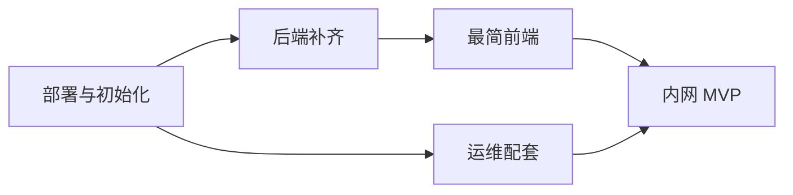

# TaskFlow 小团队内网 MVP 实施清单

> 目标：让 5–20 人的内网团队**日常可用**地创建、分配、流转、验收任务。  
> 范围：不追求对外 SaaS 能力（MFA、SSO、多租户、CD 流水线等延后）。  
> 预估总工期：**1.5–2.5 周**（1 后端 + 1 前端，兼职可按 Phase 拆分）。

---

## 0. 完成定义（Definition of Done）

全部满足即视为内网 MVP 上线：

- [x] 同事通过浏览器完成登录，无需 curl / Postman（`web/` 已实现；建议人工点验一次）
- [x] owner 能创建任务、分配给团队成员、审批/驳回（API 验收已通过）
- [x] assignee 能 start / submit（API 验收已通过）
- [x] 任务详情可查看 records 与 audit_logs 时间线
- [x] `DEV_MODE=false` 下 compose 一键起服，重启后数据不丢（P3-11 已通过）
- [x] 有首批用户初始化流程（compose `bootstrap` one-shot，不依赖 dev seed）
- [x] 有 Mongo 备份脚本与恢复说明（P3-12 已通过）
- [x] 内网同事能在 5 分钟内按文档完成「加一个新用户」

---

## 1. 阶段总览

| 阶段 | 内容 | 预估 | 阻塞关系 |
|------|------|------|----------|
| **P0** | 内网部署与用户初始化 | 1–2 天 | 无 |
| **P1** | 后端缺口（用户列表、CORS、注册策略） | 2–3 天 | 依赖 P0 环境 |
| **P2** | 最简前端 | 4–6 天 | 依赖 P1 |
| **P3** | 运维配套（备份、手册、验收） | 1–2 天 | 可与 P2 并行 |



---

## 2. P0 — 内网部署与用户初始化

### 2.1 环境准备

| # | 任务 | 验收标准 | 估时 |
|---|------|----------|------|
| P0-1 | 准备内网主机（或 VM），安装 Docker + Docker Compose | `docker compose version` 可用 | 0.5h |
| P0-2 | 生成强随机 `JWT_SECRET`（≥32 字节） | 不提交到 git，写入 `.env` 或密钥文件 | 0.5h |
| P0-3 | 复制并调整 compose 环境变量 | `DEV_MODE=false`，`TASK_REPOSITORY_DRIVER=mongo` | 0.5h |
| P0-4 | 首次启动：`docker compose up -d --build` | `GET /readyz` 返回 200 | 1h |
| P0-5 | 确认 migration 已执行 | `schema_migrations` 有记录；集合与索引存在 | 0.5h |

**参考命令：**

```bash
# 生成密钥（示例）
openssl rand -hex 32

# 启动
docker compose up -d --build

# 健康检查
curl -s http://<内网主机>:8080/readyz
```

### 2.2 首批用户 Bootstrap

当前 `seedDefaultUsers` 仅在 `DEV_MODE=true` 生效。内网生产需单独流程：

| # | 任务 | 验收标准 | 估时 |
|---|------|----------|------|
| P0-6 | 新增 `scripts/bootstrap_users.sh`（或 `cmd/bootstrap`） | 可幂等创建 1 个 owner + N 个成员 | 2h |
| P0-7 | 脚本调用 `POST /users` 或直连 DB（二选一，推荐 API） | 重复执行不报错（已存在则跳过） | 1h |
| P0-8 | 文档记录默认账号仅用于首次登录，**首次登录后改密码** | 写入本文档 §7 | 0.5h |

**Bootstrap 输入示例（`users.json`）：**

```json
[
  { "id": "u_owner", "name": "Team Owner", "role": "owner", "password": "<临时密码>" },
  { "id": "u_alice", "name": "Alice", "role": "human", "password": "<临时密码>" },
  { "id": "u_agent", "name": "Hermes", "role": "agent", "password": "<临时密码>" }
]
```

### 2.3 内网网络

| # | 任务 | 验收标准 | 估时 |
|---|------|----------|------|
| P0-9 | 确认内网 DNS 或 hosts（如 `taskflow.internal`） | 团队能解析到服务 IP | 0.5h |
| P0-10 | （推荐）前置 Nginx/Caddy 提供 HTTPS | 浏览器无 mixed-content 告警 | 2h |
| P0-11 | 防火墙仅放行内网网段访问 8080/443 | 公网不可达 | 1h |

**P0 阶段出口检查：**

- [ ] `curl -X POST .../auth/login` 用 bootstrap 账号可拿到 token
- [ ] `curl -H "Authorization: Bearer ..." .../me` 返回用户信息
- [ ] `curl .../tasks` 返回空列表或已有任务

---

## 3. P1 — 后端补齐（内网阻断项）

### 3.1 用户列表 API

| # | 任务 | 文件/位置 | 验收标准 | 估时 |
|---|------|-----------|----------|------|
| P1-1 | `GET /users` — 仅 authenticated；owner 看全部，其他人看自己 | `handler/identity.go`, `service/identity_service.go` | 返回 `id,name,role,active`（不含 password） | 3h |
| P1-2 | 可选：`?active=true` 过滤 | query 参数 | assign 下拉只显示 active 用户 | 1h |
| P1-3 | 单测 + handler 测试 | `*_test.go` | `go test ./...` 通过 | 2h |

**响应形状建议：**

```json
{
  "users": [
    { "id": "u_alice", "name": "Alice", "role": "human", "active": true }
  ]
}
```

### 3.2 CORS

| # | 任务 | 文件/位置 | 验收标准 | 估时 |
|---|------|-----------|----------|------|
| P1-4 | 新增 `CORS_ALLOWED_ORIGINS` 配置（逗号分隔） | `config/config.go` | 未配置时不启用 CORS | 1h |
| P1-5 | 新增 `middleware.CORS()` | `middleware/cors.go` | 允许 `Authorization`、`Idempotency-Key`、`Content-Type` | 2h |
| P1-6 | `router` 注册 CORS 中间件 | `router/router.go` | 前端 dev server 可跨域调 API | 0.5h |
| P1-7 | 测试：preflight `OPTIONS` 返回正确头 | `middleware/cors_test.go` | 测试通过 | 1h |

**内网 compose 示例：**

```env
CORS_ALLOWED_ORIGINS=http://taskflow.internal:5173,https://taskflow.internal
```

### 3.3 注册策略（内网建议）

| # | 任务 | 方案 | 验收标准 | 估时 |
|---|------|------|----------|------|
| P1-8 | 限制公开注册 | **方案 A（推荐）**：`POST /users` 改为需 owner 鉴权；bootstrap 脚本创建首批用户 | 匿名无法注册 | 2h |
| P1-8b | 或 | **方案 B**：保留公开注册 + `ALLOW_PUBLIC_REGISTER=false` 开关 | 内网默认关闭 | 2h |

### 3.4 启动护栏（可选但建议）

| # | 任务 | 验收标准 | 估时 |
|---|------|----------|------|
| P1-9 | `DEV_MODE=true` 且 `APP_VERSION!=dev` 时启动 warning/fatal | 防止内网误开 dev 鉴权绕过 | 1h |
| P1-10 | `JWT_SECRET` 长度过短时报错 | 拒绝弱密钥上线 | 0.5h |

**P1 阶段出口检查：**

- [ ] `GET /users` 在 owner token 下返回团队成员
- [ ] 浏览器从 `localhost:5173` 调 API 无 CORS 错误
- [ ] 未登录无法 `POST /users`（若采用方案 A）

---

## 4. P2 — 最简前端（`web/`）

### 4.1 脚手架

| # | 任务 | 验收标准 | 估时 |
|---|------|----------|------|
| P2-1 | 初始化 `web/`：`Vite + React + TypeScript` | `npm run dev` 可启动 | 1h |
| P2-2 | 添加 Tailwind + shadcn/ui（或 Ant Design 二选一） | 基础 Button/Input/Card 可用 | 2h |
| P2-3 | Vite proxy：`/api` → `http://localhost:8080` | 开发期无 CORS 问题 | 0.5h |
| P2-4 | 环境变量 `VITE_API_BASE` | dev/prod 可切换 | 0.5h |

### 4.2 API 层与鉴权

| # | 任务 | 文件建议 | 验收标准 | 估时 |
|---|------|----------|----------|------|
| P2-5 | `src/types/api.ts` 与后端 model 对齐 | Task、User、ErrorResponse | 类型完整 | 2h |
| P2-6 | `src/lib/apiClient.ts` | 自动带 Bearer；401 时 refresh 重试 | refresh 失败跳转登录 | 4h |
| P2-7 | `src/lib/auth.ts` | token 存 sessionStorage | 刷新页面保持登录 | 1h |
| P2-8 | 统一错误展示（`error.code` + `request_id`） | Toast 或 Alert | 403/404 有友好提示 | 2h |

### 4.3 页面（MVP 范围）

| # | 页面 | 路由 | 对接 API | 估时 |
|---|------|------|----------|------|
| P2-9 | 登录 | `/login` | `POST /auth/login` | 3h |
| P2-10 | 任务列表 | `/tasks` | `GET /tasks` | 4h |
| P2-11 | 创建任务 | `/tasks/new` | `POST /tasks` | 2h |
| P2-12 | 任务详情 | `/tasks/:id` | `GET /tasks/:id` | 6h |
| P2-13 | 状态动作区 | （详情页内） | `assign/start/submit/...` | 6h |
| P2-14 | 记录时间线 | （详情页 Tab） | `GET /tasks/:id/records` | 2h |
| P2-15 | 审计时间线 | （详情页 Tab） | `GET /tasks/:id/audit_logs` | 2h |
| P2-16 | 我的信息 | `/me` | `GET /me` | 1h |

### 4.4 状态机 UI（核心）

| # | 任务 | 验收标准 | 估时 |
|---|------|----------|------|
| P2-17 | `src/domain/taskWorkflow.ts` | 按钮显隐与后端权限一致 | 3h |
| P2-18 | assign 使用 `GET /users` 下拉 | 不再手填 user id | 2h |
| P2-19 | submit/reject/approve/cancel/reactivate 弹窗填 `content` | 空 content 前端校验 | 2h |
| P2-20 | 状态 Stepper 展示 `open → ... → completed` | 当前状态高亮 | 3h |

**状态机按钮矩阵（须与后端一致）：**

| 状态 | owner（creator） | assignee |
|------|------------------|----------|
| `open` | assign, cancel, delete | — |
| `assigned` | cancel, delete | start |
| `in_progress` | cancel | submit |
| `submitted` | approve, reject | — |
| `approved` | close | — |
| `cancelled` / `completed` | reactivate | — |

### 4.5 前端不做（本阶段）

- 用户管理后台（disable / revoke-sessions）→ 第二期，MVP 用 API/curl
- 密码重置页面 → 第二期，MVP 找 owner 处理
- 注册页面 → 若关闭公开注册则不做
- 分页、搜索、附件、通知

**P2 阶段出口检查：**

- [ ] 完整走通：创建 → 分配 → 开始 → 提交 → 审批 → 关闭
- [ ] 驳回后 assignee 可再次 start
- [ ] 无权限时按钮不可见或 disabled，接口 403 有提示
- [ ] 两个不同角色账号实测通过

---

## 5. P3 — 运维配套

### 5.1 备份与恢复

| # | 任务 | 验收标准 | 估时 |
|---|------|----------|------|
| P3-1 | `scripts/backup_mongo.sh` | 输出带时间戳的 archive 到备份目录 | 2h |
| P3-2 | `scripts/restore_mongo.sh` | 文档化恢复步骤；在测试库验证过一次 | 2h |
| P3-3 | cron 示例（每日凌晨） | 写入 §7；保留最近 7 份 | 0.5h |

```bash
# 备份示例
mongodump --uri="$MONGODB_URI" --db=taskflow --archive="backup/taskflow-$(date +%Y%m%d).gz" --gzip
```

### 5.2 内网运维手册（一页纸）

| # | 章节 | 内容 |
|---|------|------|
| P3-4 | 日常巡检 | `docker compose ps`、`/readyz`、`/metrics` |
| P3-5 | 重启 | `docker compose restart taskflow` |
| P3-6 | 升级 | build 新镜像 → migrate → 滚动重启 |
| P3-7 | 加用户 | bootstrap 脚本或 owner 调 API |
| P3-8 | 忘密码 | owner disable + 重建，或第二期 reset |
| P3-9 | 故障排查 | 看 `request_id`、Mongo 连接、JWT 过期 |

### 5.3 验收演练

| # | 场景 | 步骤 | 通过 |
|---|------|------|------|
| P3-10 | 冷启动 | compose down -v → up → bootstrap → 登录 | [x] `intranet_acceptance.sh` |
| P3-11 | 重启保数据 | 创建任务 → restart → 任务仍在 | [x] `intranet_acceptance.sh` |
| P3-12 | 备份恢复 | backup → 清库 → restore → 数据回来 | [x] `intranet_acceptance.sh` |
| P3-13 | 双人协作 | owner + assignee 各浏览器走完整流程 | [~] API 已通过；浏览器 UI 待人工点验 |

---

## 6. 分工建议

| 角色 | P0 | P1 | P2 | P3 |
|------|----|----|----|----|
| 后端 | 部署、bootstrap 脚本 | 用户列表、CORS、注册策略 | 联调支持 | 备份脚本 |
| 前端 | — | 类型定义可先行 | 全部页面 | 构建产物部署 |
| 运维 | 网络、HTTPS、防火墙 | — | Nginx 反代静态资源 | 备份 cron、手册 |

---

## 7. 内网部署速查

### 7.1 最小 `.env`（内网）

```env
DEV_MODE=false
TASK_REPOSITORY_DRIVER=mongo
MONGODB_URI=mongodb://mongo:27017/?replicaSet=rs0
MONGODB_DATABASE=taskflow
JWT_SECRET=<openssl rand -hex 32>
APP_VERSION=intranet-1.0.0
LOG_LEVEL=info
CORS_ALLOWED_ORIGINS=https://taskflow.internal
```

### 7.2 推荐访问架构

```text
浏览器 → Nginx (443, / + /api 反代) → taskflow:8080
                └─ /              → web/dist 静态文件（可选同域部署）
```

同域部署可省 CORS；前后端分离则需配置 `CORS_ALLOWED_ORIGINS`。

### 7.3 加新用户（MVP 期）

```bash
# owner 登录拿 token 后
curl -X POST http://taskflow.internal/api/users \
  -H "Authorization: Bearer <token>" \
  -H "Content-Type: application/json" \
  -d '{"id":"u_bob","name":"Bob","role":"human","password":"temp-pass-123"}'
```

（需 P1-8 完成后，注册接口需 owner 鉴权。）

---

## 8. 风险与缓解

| 风险 | 影响 | 缓解 |
|------|------|------|
| Mongo 单节点 replica set | 磁盘故障丢数据 | P3 备份 + volume 放可靠存储 |
| 无邮件重置 | 忘密码找 admin | 文档写清 owner 处理流程 |
| 任务量增长后列表变慢 | 页面卡顿 | >500 条时补分页（第二期） |
| `JWT_SECRET` 泄露 | 全员需重新登录 | 轮换密钥 + revoke-sessions |
| 误开 `DEV_MODE` | 鉴权绕过 | P1-9 启动护栏 |

---

## 9. 第二期 backlog（内网增强，非 MVP 阻断）

- [ ] `POST /users` 管理页（owner 创建/禁用用户）
- [ ] 密码重置页（接邮件或企业微信 webhook）
- [ ] `GET /tasks` 分页 + 按 status/assignee 筛选
- [ ] compose 中加入 `web` 服务或 Nginx 一体化镜像
- [ ] Prometheus + Grafana 最小看板（请求量、错误率、限流命中）
- [ ] OpenAPI 文档生成

---

## 10. 检查表（打印勾选）

```
部署
  [x] compose 启动成功，/readyz 200
  [x] DEV_MODE=false
  [ ] JWT_SECRET 已更换默认值（生产须替换 compose 示例值）
  [x] 首批用户已 bootstrap（compose bootstrap 服务）

后端
  [x] GET /users 可用
  [x] CORS 已配置（compose: localhost:5173）
  [x] 公开注册已关闭或受限

前端
  [x] 登录 / 任务列表 / 详情 / 动作按钮
  [x] assign 下拉选用户
  [x] records + audit 时间线

运维
  [x] 备份脚本 + cron 示例
  [x] 恢复演练通过
  [x] 一页运维手册（INTRANET_OPS.md）

验收
  [~] 双人完整流程（API 已通过；浏览器待点验）
  [x] 重启后数据保留
```

---

*文档版本：2026-06-15 · 配套文档：`DEPLOYMENT.md`、`README.md`*