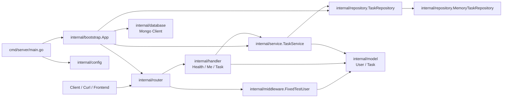

# TaskFlow

TaskFlow 是一个面向任务协作 / 工单管理场景的 Go 后端练习项目。

当前目标不是一次性做完整用户系统，而是先围绕 V0 范围搭出可运行骨架，并逐步打通任务闭环主链。

## Architecture

当前 TaskFlow 采用分层后端结构：



### Layer responsibilities

- `cmd/server/main.go`
  - 程序启动入口
  - 加载配置并启动应用

- `internal/config`
  - 加载运行配置，例如端口和 MongoDB 设置

- `internal/bootstrap`
  - 负责应用装配
  - 构建 router、service、repository 和 database client

- `internal/router`
  - 注册 Gin 路由

- `internal/middleware`
  - 将固定测试用户注入请求上下文

- `internal/handler`
  - 处理 HTTP 请求与响应
  - 解析输入，并将 service 错误映射成 HTTP 状态码

- `internal/service`
  - 承载业务规则与校验逻辑

- `internal/repository`
  - 定义数据访问抽象
  - 当前实现仍使用内存存储

- `internal/model`
  - 定义核心数据结构，例如 `User` 和 `Task`

- `internal/database`
  - 初始化 MongoDB 客户端基础设施

### Current status

- MongoDB client bootstrap 已接入
- Task 数据当前仍通过 `MemoryTaskRepository` 管理
- 当前可运行接口：
  - `GET /health`
  - `GET /me`
  - `POST /tasks`
  - `GET /tasks`
  - `GET /tasks/:id`
  - `PATCH /tasks/:id`

## 当前进度

当前已完成的最小工程骨架：
- Gin 作为 Web 框架
- `cmd/server/main.go` 作为启动入口
- `internal/bootstrap` 负责应用装配
- `internal/config` 负责最小配置加载
- `internal/router` 负责路由注册
- `internal/handler` 提供 `/health` 与 `/me` 接口
- `internal/database` 提供 MongoDB 初始化骨架
- `internal/middleware` 提供固定测试用户注入
- `internal/model` 提供最小 `User` 结构

当前可运行接口：
- `GET /health`
- `GET /me`

返回示例：

```json
{
  "status": "ok"
}
```

```json
{
  "user": {
    "id": "u_test_001",
    "name": "Test User",
    "role": "owner"
  }
}
```

## 本地启动

### 1. 安装依赖

```bash
go mod tidy
```

### 2. 准备环境变量

```bash
cp .env.example .env
```

当前默认环境变量：
- `PORT=8080`
- `MONGODB_URI=mongodb://localhost:27017`
- `MONGODB_DATABASE=taskflow`

### 3. 启动服务

```bash
go run ./cmd/server
```

默认监听端口：`8080`

也可以通过环境变量覆盖：

```bash
PORT=8081 MONGODB_URI=mongodb://localhost:27017 MONGODB_DATABASE=taskflow go run ./cmd/server
```

### 4. 检查服务

```bash
curl http://localhost:8080/health
curl http://localhost:8080/me
```

## 当前 V0 边界

Week 2 当前优先级：
1. 项目骨架
2. 配置 / 路由 / 数据库接线
3. 最小身份能力
4. Task 基础能力
5. 动作型接口：`assign / start / submit / approve / reject / close`

当前明确先不做：
- 完整注册 / 登录系统
- JWT 完整方案
- 子任务
- 多协作者关系表
- Redis
- 异步任务
- 通用工作流引擎

## 下一步

下一步应优先补齐：
- Task 基础能力：创建、详情、列表、更新 `title` / `description`
- 让 router / handler / service / repository 开始围绕任务主链落地
- 后续再把当前固定测试身份替换为更真实的最小用户来源
