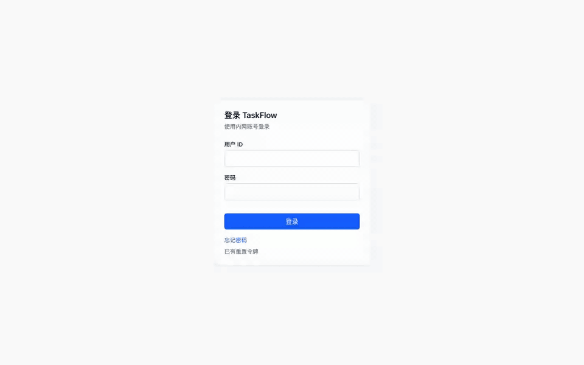
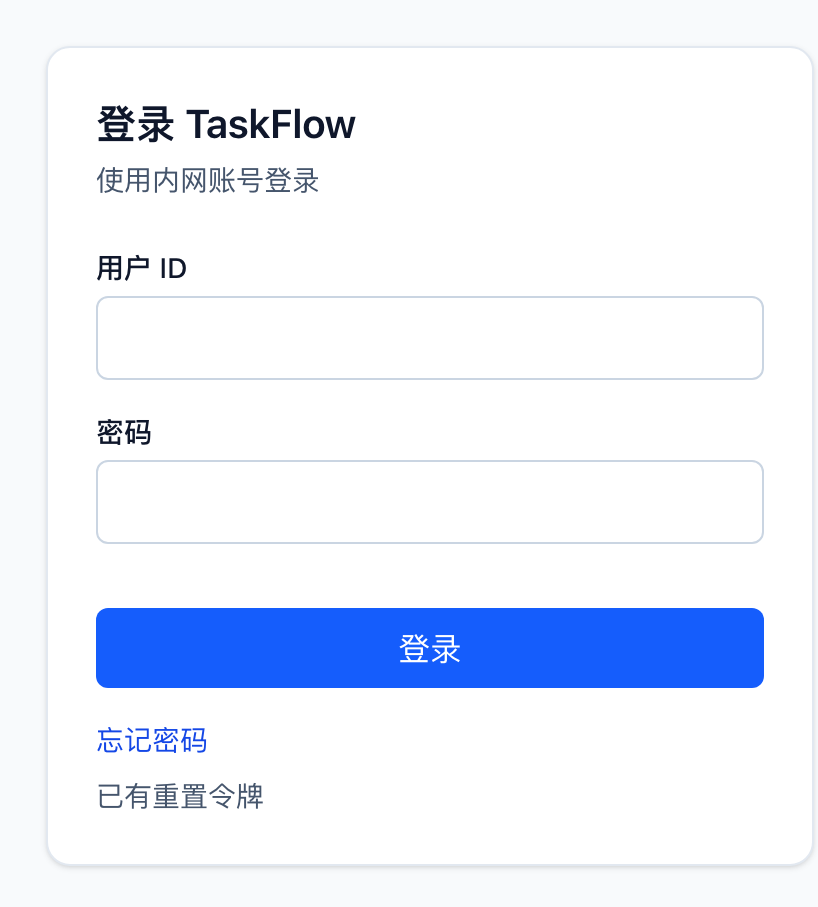
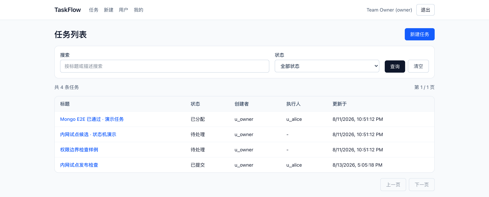
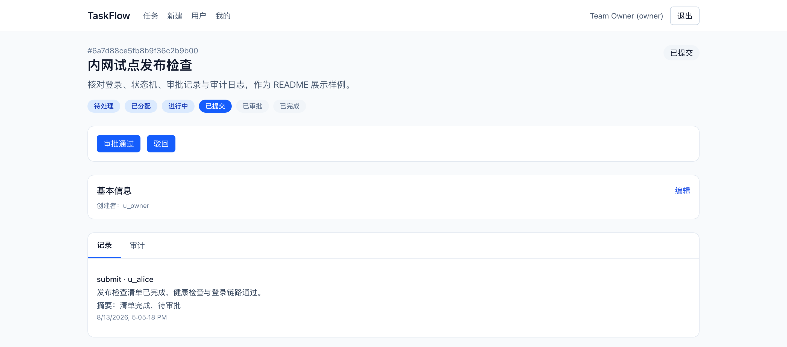
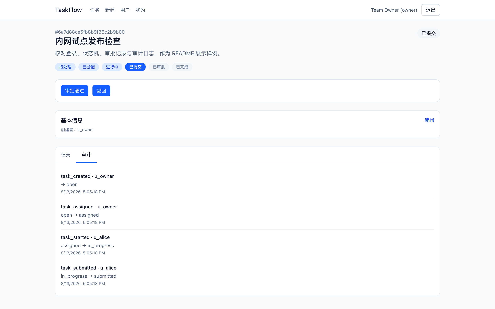
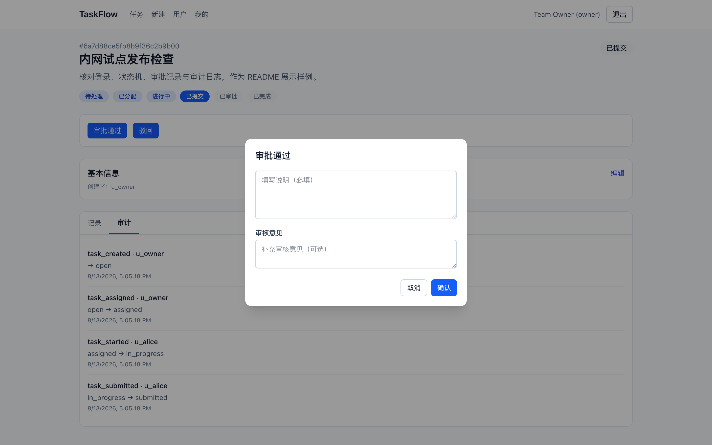
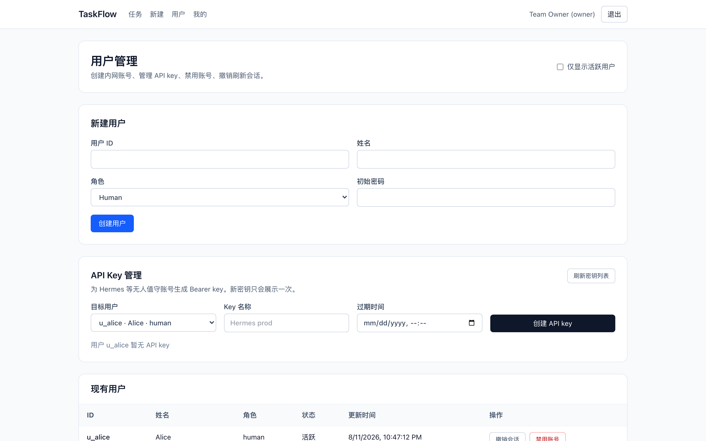

# TaskFlow

English | [简体中文](./README_ZH.md)

Internal task workflow system: Go API + React workbench + Mongo persistence.

```text
create → assign → start → submit → approve/reject → close
```

Intranet MVP / pilot-candidate. **Maintenance mode** — not enterprise production.

[](https://github.com/AsaqeLee/taskflow/actions/workflows/ci.yml)

## Demo

Local compose walkthrough (login → task list → submitted task → audit → approve dialog).



[MP4](docs/demo/walkthrough.mp4)

| Login | Task list |
|---|---|
|  |  |

| Task detail | Audit |
|---|---|
|  |  |

| Approve | Users |
|---|---|
|  |  |

Media notes: [`docs/demo/README.md`](docs/demo/README.md). Screenshots are a local stack, not a live intranet deploy.

## What it does

- Explicit task state machine with role-constrained actions
- Backend returns `available_actions`; the UI prefers that and keeps a fallback matrix
- JWT login, refresh rotation, password reset, account disable, session revoke
- API keys for unattended / agent callers
- Collaboration records + audit log on each task
- Health / ready / live / metrics, structured logs, optional OTLP
- Mongo + memory dual persistence, migrations, bootstrap, backup scripts
- Same-origin nginx workbench: list, detail, create, users, profile

## Quick start

### Fastest: API only

Needs Go `1.25.12`.

```bash
go test ./...

DEV_MODE=true \
TASK_REPOSITORY_DRIVER=memory \
JWT_SECRET=change-me-change-me-change-me-123 \
go run ./cmd/server
```

Dev-mode seed users (local only):

- `u_test_001` / `creator-pass-123`
- `u_test_002` / `assignee-pass-123`
- `u_agent_001` / `agent-pass-123`

### Frontend preview

Needs Node `22`. Start the API first:

```bash
cd web
npm ci
VITE_API_PROXY_TARGET=http://localhost:8080 npm run dev
```

Open `http://127.0.0.1:5173`. The Vite server proxies `/api` to the backend.

### Local Mongo + UI (the demo stack)

```bash
docker compose --profile full up -d --build
bash scripts/compose_smoke.sh
bash scripts/nginx_smoke.sh
```

- API: `http://127.0.0.1:8080`
- Web: `http://127.0.0.1:8081`
- Mongo on the host: `127.0.0.1:27018`

Compose bootstrap users come from the mounted users file (often `scripts/users.intranet.json` locally, `scripts/users.example.json` in the repo). Do not commit real passwords.

## Repository layout

```text
taskflow/
├── cmd/                 # server, migrate, bootstrap
├── internal/            # domain, handlers, services, repos
├── web/                 # React + Vite workbench
├── docs/demo/           # README screenshots + walkthrough
├── scripts/             # smoke, rollout, audits
├── deploy/              # local observability config
└── reports/             # release / security notes
```

## API surface

Public:

- `POST /auth/login` — body field is `id`, not `username`
- `POST /auth/refresh`
- `POST /auth/password-reset/request`
- `POST /auth/password-reset/confirm`
- `POST /users` when public registration is enabled

Authenticated:

- `GET /me`
- `GET /users`
- `POST /users/:id/disable`
- `POST /users/:id/revoke-sessions`
- `POST /tasks`
- `GET /tasks`
- `GET /tasks/:id`
- `PATCH /tasks/:id`
- `DELETE /tasks/:id`
- `POST /tasks/:id/{assign,start,submit,reject,approve,close,cancel,reactivate}`
- `GET /tasks/:id/records`
- `GET /tasks/:id/audit_logs`

System: `GET /health` · `GET /livez` · `GET /readyz` · `GET /metrics`

## Tests

```bash
go test ./...
go vet ./...

cd web
npm ci
npm run lint
npm run test
npm run build
```

Helpers: `scripts/compose_smoke.sh`, `scripts/web_build_smoke.sh`, `scripts/web_acceptance_smoke.sh`, `scripts/nginx_smoke.sh`, `scripts/intranet_acceptance.sh`, `scripts/security_audit.sh`.

CI: [`.github/workflows/ci.yml`](./.github/workflows/ci.yml).

## Ops docs

- [`DEPLOYMENT.md`](./DEPLOYMENT.md)
- [`MIGRATIONS.md`](./MIGRATIONS.md)
- [`INTRANET_RELEASE_CHECKLIST.md`](./INTRANET_RELEASE_CHECKLIST.md)
- [`INTRANET_RUNBOOK.md`](./INTRANET_RUNBOOK.md)
- [`INTRANET_OPS.md`](./INTRANET_OPS.md)
- [`ACCEPTANCE_TESTING.md`](./ACCEPTANCE_TESTING.md)
- [`docs/团队收尾.md`](./docs/团队收尾.md)

Production should use `DEV_MODE=false`, `STRICT_PRODUCTION_CONFIG=true`, `TASK_REPOSITORY_DRIVER=mongo`, and a real `PASSWORD_RESET_WEBHOOK_URL`. Mongo write paths that use transactions need a replica set member or `mongos`.
