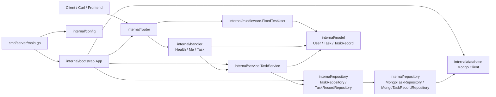
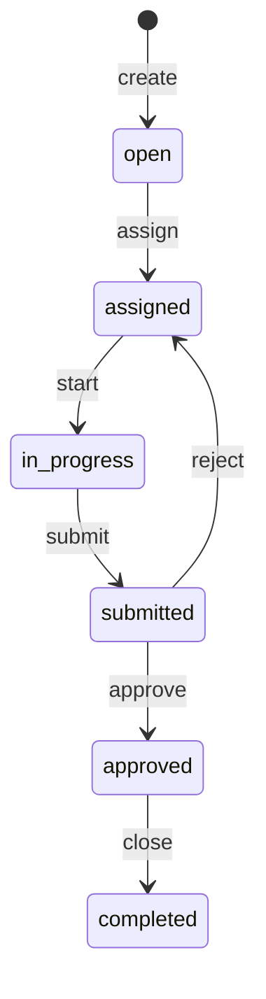

# TaskFlow

TaskFlow 是一个面向任务协作 / 工单管理场景的 Go 后端练习项目。

当前阶段不是一次性做完整用户系统，而是先围绕 V0 范围搭出一个**可运行、可测试、可继续扩展**的任务流转骨架，优先打通任务主链：

`create -> assign -> start -> submit -> approve/reject -> close`

---

## 0. 恢复开发前先看

如果你隔了一段时间才回来，不要先从代码海里重新摸索，先看这里。

### 当前项目一句话状态

TaskFlow 目前已经完成 **Task CRUD + 主动作链闭环**，并正在补齐 **dual-driver 本地开发模式**：

- 默认仓储驱动：`memory`
- 可切换仓储驱动：`mongo`
- 当前动作主链：`create -> assign -> start -> submit -> approve/reject -> close`
- 当前测试机制：固定测试用户 `u_test_001`

### 5 分钟恢复阅读路径

如果只想快速恢复理解，建议按这个顺序：

1. 先读本 README 的：
   - `当前能力概览`
   - `当前状态流转`
   - `恢复验证清单`
   - `当前唯一优先事项`
2. 再看代码：
   - `internal/service/task_service.go`：业务规则 / 状态机
   - `internal/handler/task.go`：HTTP 输入输出与错误映射
   - `internal/router/router.go`：接口挂载
   - `internal/repository/`：memory / mongo 两套持久化实现
   - `internal/bootstrap/app.go`：驱动选择与应用装配

### 当前唯一优先事项

把项目稳定成一个**随时能恢复运行、恢复验证、恢复理解**的 V0 样板：

- 固定 dual-driver 本地开发方式：`memory | mongo`
- 固定恢复验证流程
- 保持 README 与真实代码状态一致

### 当前明确不做

当前先不扩到这些方向：

- 完整注册 / 登录系统
- JWT / Session 认证
- 多协作者关系
- 子任务
- 评论 / 回执 / 审计的完整体系
- 通用工作流引擎
- 前端界面

---

## 1. 项目定位

TaskFlow 当前更像一个 **任务生命周期后端实验场**，用于沉淀以下能力：

- 用 Gin 搭建清晰的后端分层结构
- 为任务协作场景定义稳定的数据模型
- 把“动作型接口”拆成明确的状态流转规则
- 为后续的人-AI协作、审计记录、真实身份系统和持久化演进预留空间

当前重点不是“功能很多”，而是：

- 接口边界明确
- 状态语义明确
- 规则能被测试覆盖
- 结构能承接后续演进

---

## 2. 当前能力概览

### 已完成

- Gin Web 框架接入
- `cmd/server/main.go` 启动入口
- `internal/bootstrap` 应用装配
- `internal/config` 最小配置加载
- `internal/router` 路由注册
- `internal/handler` HTTP 请求处理
- `internal/service` 业务规则与状态流转
- `internal/repository` 仓储抽象
- MongoDB TaskRepository / TaskRecordRepository 实现已接入
- `internal/database` Mongo 客户端初始化
- 固定测试用户注入中间件
- Task 基础 CRUD（当前是 create / list / get / update basic）
- Task 动作型接口：`assign / start / submit / reject / approve / close`
- 最小 `TaskRecord` 已接入 `submit / reject / approve` 三个协作动作，并支持按任务查询
- 单元测试已覆盖多条主链和错误分支

### 当前可运行接口

- `GET /health`
- `GET /me`
- `POST /tasks`
- `GET /tasks`
- `GET /tasks/:id`
- `GET /tasks/:id/records`
- `PATCH /tasks/:id`
- `POST /tasks/:id/assign`
- `POST /tasks/:id/start`
- `POST /tasks/:id/submit`
- `POST /tasks/:id/reject`
- `POST /tasks/:id/approve`
- `POST /tasks/:id/close`

### 当前仍未做

- 完整注册 / 登录系统
- JWT / Session 认证
- 完整评论 / 审计体系（当前仅支持最小 TaskRecord 写入与按任务查询）
- cancel / reactivate / delete 等动作闭环
- 子任务
- 多协作者关系
- 通用工作流引擎
- 更完整的权限模型

---

## 3. 当前架构



### 分层职责

- `cmd/server/main.go`
  - 程序启动入口
  - 加载配置并启动服务

- `internal/config`
  - 读取环境变量配置
  - 当前负责端口、Mongo URI、MongoDB 数据库名

- `internal/bootstrap`
  - 装配应用依赖
  - 构建 database、repository、service、handler、router

- `internal/router`
  - 注册 Gin 路由
  - 组织公开接口与需注入用户的接口

- `internal/middleware`
  - 注入固定测试用户到请求上下文

- `internal/handler`
  - 处理 HTTP 请求
  - 解析输入
  - 把 service 错误映射为 HTTP 状态码

- `internal/service`
  - 承载任务业务规则
  - 负责状态流转校验与权限约束

- `internal/repository`
  - 定义 `TaskRepository` / `TaskRecordRepository` 抽象
  - 当前已提供 Mongo 与 memory 两套实现，用于环境切换与早期演化

- `internal/model`
  - 定义核心领域结构，例如 `Task` / `User`

- `internal/database`
  - 初始化 MongoDB 客户端基础设施

---

## 4. 当前数据模型

### Task

当前 `Task` 模型字段：

```go
type Task struct {
    ID          string
    Title       string
    Description string
    Status      string
    CreatorID   string
    AssigneeID  string
    CreatedAt   time.Time
    UpdatedAt   time.Time
}
```

这说明当前版本仍然是 **V0 级别的最小任务模型**，重点只放在：

- 任务基本信息
- 创建者 / 执行者
- 当前状态
- 创建 / 更新时间

尚未加入：

- owner / reviewer / collaborators
- comments / receipts
- operation logs / audit trail
- due date / priority / labels
- parent task / child task

---

## 5. 当前状态流转

当前已落地的状态：

- `open`
- `assigned`
- `in_progress`
- `submitted`
- `approved`
- `completed`

### 状态流转图



### 主链

```text
open -> assigned -> in_progress -> submitted -> approved -> completed
```

### 驳回支线

```text
submitted -> assigned
```

### 当前已实现的规则

- 创建任务后默认状态为 `open`
- 仅创建者可执行 `assign`
- `assign` 仅允许 `open -> assigned`
- 当前版本不支持重新分配
- 仅 assignee 可执行 `start`
- `start` 仅允许 `assigned -> in_progress`
- 仅 assignee 可执行 `submit`
- `submit` 仅允许 `in_progress -> submitted`
- `submit` 需要 `content`，并写入一条 `TaskRecord`
- 仅创建者可执行 `reject`
- `reject` 仅允许 `submitted -> assigned`
- `reject` 需要 `content`，并写入一条 `TaskRecord`
- 仅创建者可执行 `approve`
- `approve` 仅允许 `submitted -> approved`
- `approve` 需要 `content`，并写入一条 `TaskRecord`
- 仅创建者可执行 `close`
- `close` 仅允许 `approved -> completed`

### 当前输入校验

- `title` 不能为空
- `title` 长度至少 3 个字符
- `assignee_id` 不能为空
- `submit / reject / approve` 的 `content` 不能为空
- `task id` 不能为空

---

## 6. 认证与当前测试用户机制

当前项目**还没有真正的登录系统**。

为了先把任务主链跑通，所有受保护接口都通过中间件注入一个固定测试用户：

```json
{
  "id": "u_test_001",
  "name": "Test User",
  "role": "owner"
}
```

因此：

- `GET /me` 会返回固定测试用户
- 任务创建时，`creator_id` 会写成 `u_test_001`
- 若要手动测试 `start / submit` 等“执行者动作”，需要把 `assignee_id` 设为 `u_test_001`

这是一种**为了先完成主链而做的 V0 简化**，后续再逐步替换成真实身份系统。

---

## 7. 本地启动

### 1) 安装依赖

```bash
go mod tidy
```

### 2) 准备环境变量

```bash
cp .env.example .env
```

当前 `.env.example` 内容为：

```env
PORT=8080
TASK_REPOSITORY_DRIVER=memory
MONGODB_URI=mongodb://localhost:27017
MONGODB_DATABASE=taskflow
```

仓储驱动说明：

- `TASK_REPOSITORY_DRIVER=memory`
  - 默认模式
  - 不需要本地 MongoDB
  - 适合当前开发、阅读代码和手动跑接口
- `TASK_REPOSITORY_DRIVER=mongo`
  - 使用 MongoDB 持久化
  - 适合集成联调和仓储验证

> 注意：当前代码直接通过环境变量读取配置，不会自动加载 `.env` 文件。
> 如果你只是复制了 `.env`，还需要用 shell 导出环境变量，或手动在启动命令前注入。

例如（memory 模式）：

```bash
export PORT=8080
export TASK_REPOSITORY_DRIVER=memory
export MONGODB_URI=mongodb://localhost:27017
export MONGODB_DATABASE=taskflow
```

或者直接一行启动：

```bash
PORT=8080 TASK_REPOSITORY_DRIVER=memory MONGODB_URI=mongodb://localhost:27017 MONGODB_DATABASE=taskflow go run ./cmd/server
```

### 3) 选择仓储模式

#### 方式 A：memory 模式（默认推荐）

不依赖数据库，适合当前开发和手测：

```bash
TASK_REPOSITORY_DRIVER=memory go run ./cmd/server
```

#### 方式 B：mongo 模式

使用 MongoDB 做真实持久化：

```bash
TASK_REPOSITORY_DRIVER=mongo MONGODB_URI=mongodb://localhost:27017 MONGODB_DATABASE=taskflow go run ./cmd/server
```

### 4) 如果使用 mongo 模式，先准备 MongoDB

当前仓库已经提供 `docker-compose.yml`，内容对应一个本地 `mongo:7` 容器，端口映射为：

```text
localhost:27017 -> container:27017
```

最简单的启动方式：

```bash
docker compose up -d
```

停止容器：

```bash
docker compose down
```

如果想连带清理数据卷：

```bash
docker compose down -v
```

### 5) 启动服务

```bash
go run ./cmd/server
```

默认监听：

```text
http://localhost:8080
```

### 6) 健康检查

```bash
curl http://localhost:8080/health
curl http://localhost:8080/me
```

---

## 8. 恢复验证清单

这一节的目的不是替代完整测试，而是让你在中断一段时间后，能用固定动作快速确认项目还“活着”。

### A. 只想确认代码没坏

```bash
go test ./...
```

如果这里不过，不要先扩功能，先回到：

- `internal/service/task_service.go`
- `internal/handler/task.go`
- `internal/repository/`
- `internal/bootstrap/app.go`

### B. memory 模式最小恢复验证

1. 启动服务：

```bash
TASK_REPOSITORY_DRIVER=memory go run ./cmd/server
```

2. 验证基础接口：

```bash
curl http://localhost:8080/health
curl http://localhost:8080/me
```

3. 跑一遍最小主链：

- `POST /tasks`
- `POST /tasks/:id/assign`（`assignee_id=u_test_001`）
- `POST /tasks/:id/start`
- `POST /tasks/:id/submit`
- `GET /tasks/:id/records`
- `POST /tasks/:id/approve`
- `POST /tasks/:id/close`

### C. mongo 模式最小恢复验证

1. 启动 Mongo：

```bash
docker compose up -d
```

2. 启动服务：

```bash
TASK_REPOSITORY_DRIVER=mongo MONGODB_URI=mongodb://localhost:27017 MONGODB_DATABASE=taskflow go run ./cmd/server
```

3. 重新跑同一条最小主链（包含 `GET /tasks/:id/records` 验证记录读取）。

如果 memory 能跑、mongo 也能跑，说明当前 TaskFlow 已具备“可恢复项目”的基本条件。

### D. 推荐固定演示链

#### 主链

```text
create -> assign -> start -> submit -> approve -> close
```

#### 驳回支线

```text
create -> assign -> start -> submit -> reject -> start -> submit -> approve -> close
```

以后每次恢复项目，只要这两条链还能跑通，你就基本知道 V0 主体没有坏。

---

## 9. 接口快速示例

### 健康检查

```bash
curl http://localhost:8080/health
```

返回示例：

```json
{
  "status": "ok"
}
```

### 查看当前用户

```bash
curl http://localhost:8080/me
```

返回示例：

```json
{
  "user": {
    "id": "u_test_001",
    "name": "Test User",
    "role": "owner"
  }
}
```

### 创建任务

```bash
curl -X POST http://localhost:8080/tasks \
  -H 'Content-Type: application/json' \
  -d '{
    "title": "Write README",
    "description": "补全 TaskFlow 项目说明"
  }'
```

### 列出任务

```bash
curl http://localhost:8080/tasks
```

### 查看任务详情

```bash
curl http://localhost:8080/tasks/<task_id>
```

### 更新任务基本信息

```bash
curl -X PATCH http://localhost:8080/tasks/<task_id> \
  -H 'Content-Type: application/json' \
  -d '{
    "title": "Write better README",
    "description": "补充启动方式、接口示例和状态流转"
  }'
```

### 指派任务

> 如果后续要继续手动测试 `start / submit`，这里建议直接把 `assignee_id` 设为 `u_test_001`。

```bash
curl -X POST http://localhost:8080/tasks/<task_id>/assign \
  -H 'Content-Type: application/json' \
  -d '{
    "assignee_id": "u_test_001"
  }'
```

### 开始执行

```bash
curl -X POST http://localhost:8080/tasks/<task_id>/start
```

### 提交结果

```bash
curl -X POST http://localhost:8080/tasks/<task_id>/submit \
  -H 'Content-Type: application/json' \
  -d '{"content":"Delivered the requested output"}'
```

### 驳回任务

```bash
curl -X POST http://localhost:8080/tasks/<task_id>/reject \
  -H 'Content-Type: application/json' \
  -d '{"content":"Please revise the handoff"}'
```

### 审核通过

```bash
curl -X POST http://localhost:8080/tasks/<task_id>/approve \
  -H 'Content-Type: application/json' \
  -d '{"content":"Accepted after review"}'
```

### 关闭任务

```bash
curl -X POST http://localhost:8080/tasks/<task_id>/close
```

### 常见失败场景

当前 handler 会把 service / repository 错误映射成：

- `400 Bad Request`
  - 参数缺失或格式错误
  - title 为空或过短
  - assignee_id 为空
  - 当前任务状态不允许执行该动作
- `403 Forbidden`
  - 当前用户没有权限执行该动作
- `404 Not Found`
  - 任务不存在
- `500 Internal Server Error`
  - 数据库或其他未预期错误

常见示例：

| 场景 | 预期状态码 | 原因 |
| --- | --- | --- |
| 创建任务时 `title` 为空 | `400` | 违反最小输入校验 |
| `assign` 时不传 `assignee_id` | `400` | 缺少必要字段 |
| 对 `open` 状态任务直接 `start` | `400` | 状态不允许 |
| 非 assignee 执行 `start` / `submit` | `403` | 无权限 |
| 非创建者执行 `assign` / `reject` / `approve` / `close` | `403` | 无权限 |
| 查询不存在的 task id | `404` | 任务不存在 |

---

## 9. 接口契约速查

> 说明：除 `GET /health` 外，其余接口当前都依赖中间件注入固定测试用户。

### `GET /health`

| Item | Value |
| --- | --- |
| Purpose | 健康检查 |
| Auth | No |
| Success | `200 OK` |
| Response | `{ "status": "ok" }` |
| Common errors | 一般无业务错误 |

### `GET /me`

| Item | Value |
| --- | --- |
| Purpose | 获取当前上下文用户 |
| Auth | Yes（当前为固定测试用户注入） |
| Success | `200 OK` |
| Response | `{ "user": { "id": "u_test_001", "name": "Test User", "role": "owner" } }` |
| Common errors | `500`：上下文中没有当前用户 |

### `POST /tasks`

| Item | Value |
| --- | --- |
| Purpose | 创建任务 |
| Auth | Yes |
| Content-Type | `application/json` |
| Request body | `{ "title": "string", "description": "string" }` |
| Success | `201 Created` |
| Response | `{ "task": Task }` |
| Common errors | `400`：JSON 非法、title 为空、title 少于 3 个字符；`500`：上下文缺用户或持久化异常 |

### `GET /tasks`

| Item | Value |
| --- | --- |
| Purpose | 获取任务列表 |
| Auth | Yes |
| Success | `200 OK` |
| Response | `{ "tasks": [Task, ...] }` |
| Common errors | `500`：仓储读取异常 |

### `GET /tasks/:id`

| Item | Value |
| --- | --- |
| Purpose | 获取单个任务详情 |
| Auth | Yes |
| Path params | `id`：任务 ID |
| Success | `200 OK` |
| Response | `{ "task": Task }` |
| Common errors | `400`：id 为空；`404`：任务不存在；`500`：仓储异常 |

### `GET /tasks/:id/records`

| Item | Value |
| --- | --- |
| Purpose | 获取任务协作记录列表 |
| Auth | Yes |
| Path params | `id`：任务 ID |
| Success | `200 OK` |
| Response | `{ "records": [TaskRecord, ...] }` |
| Common errors | `400`：id 为空；`404`：任务不存在；`500`：仓储异常 |

### `PATCH /tasks/:id`

| Item | Value |
| --- | --- |
| Purpose | 更新任务基础信息 |
| Auth | Yes |
| Content-Type | `application/json` |
| Path params | `id`：任务 ID |
| Request body | `{ "title": "string", "description": "string" }` |
| Success | `200 OK` |
| Response | `{ "task": Task }` |
| Common errors | `400`：JSON 非法、id 为空、title 为空、title 少于 3 个字符；`404`：任务不存在；`500`：仓储异常 |

### `POST /tasks/:id/assign`

| Item | Value |
| --- | --- |
| Purpose | 指派任务给执行者 |
| Auth | Yes |
| Content-Type | `application/json` |
| Path params | `id`：任务 ID |
| Request body | `{ "assignee_id": "string" }` |
| Success | `200 OK` |
| Response | `{ "task": Task }` |
| Common errors | `400`：JSON 非法、id 为空、assignee_id 为空、状态不是 `open`；`403`：当前用户不是创建者；`404`：任务不存在；`500`：仓储异常 |

### `POST /tasks/:id/start`

| Item | Value |
| --- | --- |
| Purpose | 让执行者开始任务 |
| Auth | Yes |
| Path params | `id`：任务 ID |
| Request body | 无 |
| Success | `200 OK` |
| Response | `{ "task": Task }` |
| Common errors | `400`：id 为空、状态不是 `assigned`；`403`：当前用户不是 assignee；`404`：任务不存在；`500`：上下文缺用户或仓储异常 |

### `POST /tasks/:id/submit`

| Item | Value |
| --- | --- |
| Purpose | 由执行者提交结果 |
| Auth | Yes |
| Path params | `id`：任务 ID |
| Request body | `{ "content": "string" }` |
| Success | `200 OK` |
| Response | `{ "task": Task, "record": TaskRecord }` |
| Common errors | `400`：JSON 非法、id 为空、content 为空、状态不是 `in_progress`；`403`：当前用户不是 assignee；`404`：任务不存在；`500`：上下文缺用户或仓储异常 |

### `POST /tasks/:id/reject`

| Item | Value |
| --- | --- |
| Purpose | 由创建者驳回提交结果 |
| Auth | Yes |
| Path params | `id`：任务 ID |
| Request body | `{ "content": "string" }` |
| Success | `200 OK` |
| Response | `{ "task": Task, "record": TaskRecord }` |
| Common errors | `400`：JSON 非法、id 为空、content 为空、状态不是 `submitted`；`403`：当前用户不是创建者；`404`：任务不存在；`500`：上下文缺用户或仓储异常 |

### `POST /tasks/:id/approve`

| Item | Value |
| --- | --- |
| Purpose | 由创建者审核通过 |
| Auth | Yes |
| Path params | `id`：任务 ID |
| Request body | `{ "content": "string" }` |
| Success | `200 OK` |
| Response | `{ "task": Task, "record": TaskRecord }` |
| Common errors | `400`：JSON 非法、id 为空、content 为空、状态不是 `submitted`；`403`：当前用户不是创建者；`404`：任务不存在；`500`：上下文缺用户或仓储异常 |

### `POST /tasks/:id/close`

| Item | Value |
| --- | --- |
| Purpose | 由创建者正式关闭任务 |
| Auth | Yes |
| Path params | `id`：任务 ID |
| Request body | 无 |
| Success | `200 OK` |
| Response | `{ "task": Task }` |
| Common errors | `400`：id 为空、状态不是 `approved`；`403`：当前用户不是创建者；`404`：任务不存在；`500`：上下文缺用户或仓储异常 |

### `Task` 响应对象

当前 README 中所有 `{ "task": Task }` / `{ "tasks": [Task] }` 的 `Task` 结构为：

```json
{
  "id": "681f...",
  "title": "Write README",
  "description": "补全项目说明",
  "status": "open",
  "creator_id": "u_test_001",
  "assignee_id": "u_test_001",
  "created_at": "2026-05-11T00:00:00Z",
  "updated_at": "2026-05-11T00:00:00Z"
}
```

### `TaskRecord` 响应对象

`submit / reject / approve` 成功时会返回一条 `record`，而 `GET /tasks/:id/records` 会返回同结构的列表项：

```json
{
  "id": "record_001",
  "task_id": "681f...",
  "author_id": "u_test_001",
  "type": "approve",
  "content": "Accepted after review",
  "created_at": "2026-05-11T00:00:00Z"
}
```

---

## 10. 建议手测路径

如果想手动走一遍最小闭环，推荐按这个顺序：

1. `POST /tasks` 创建任务
2. `POST /tasks/:id/assign`，把 `assignee_id` 设为 `u_test_001`
3. `POST /tasks/:id/start`
4. `POST /tasks/:id/submit`
5. `GET /tasks/:id/records`（可选，用于确认提交记录已写入）
6. `POST /tasks/:id/approve`
7. `GET /tasks/:id/records`（可选，用于确认审核记录已写入）
8. `POST /tasks/:id/close`

如果要测试驳回支线：

1. 创建任务
2. 指派给 `u_test_001`
3. `start`
4. `submit`
5. `GET /tasks/:id/records`（可选）
6. `reject`
7. 再次 `start`
8. 再次 `submit`
9. `approve`
10. `GET /tasks/:id/records`（可选）
11. `close`

---

## 11. 目录结构

```text
TaskFlow/
├── cmd/
│   └── server/
│       └── main.go
├── docs/
│   ├── V0 数据模型草案.md
│   ├── V0 模块与职责边界.md
│   └── 项目目标.md
├── internal/
│   ├── bootstrap/
│   │   ├── app.go
│   │   └── app_test.go
│   ├── config/
│   │   └── config.go
│   ├── database/
│   │   └── mongo.go
│   ├── handler/
│   │   ├── health.go
│   │   ├── identity.go
│   │   ├── task.go
│   │   └── task_test.go
│   ├── middleware/
│   │   └── current_user.go
│   ├── model/
│   │   ├── task.go
│   │   └── user.go
│   ├── repository/
│   │   ├── task_memory.go
│   │   ├── task_mongo.go
│   │   ├── task_mongo_test.go
│   │   └── task_repository.go
│   ├── router/
│   │   └── router.go
│   └── service/
│       ├── task_service.go
│       └── task_service_test.go
├── .env.example
├── go.mod
├── go.sum
└── README.md
```

---

## 12. 测试

运行全部测试：

```bash
go test ./...
```

当前测试重点主要覆盖：

- service 层状态流转规则
- handler 层状态码与响应语义
- repository 层基础持久化行为
- bootstrap 装配逻辑

---

## 14. 当前 V0 边界

当前阶段优先级：

1. 项目骨架稳定
2. 配置 / 路由 / dual-driver 接线稳定
3. 最小身份能力
4. Task 基础能力
5. 动作型接口闭环
6. 为后续评论 / 记录 / 审计演进留好结构

当前明确先不做：

- 完整用户系统
- JWT 完整方案
- 多执行者并发协作
- Redis
- 异步任务系统
- 通用工作流引擎
- 重型项目管理能力
- 前端界面

---

## 15. 下一步建议

如果从“可恢复项目”目标继续推进，当前最自然的下一步不是继续加很多新功能，而是继续降低恢复成本。

### 当前唯一优先事项

完成并固定 dual-driver 本地开发模式：

- 默认 `memory`
- 可切换 `mongo`
- README 中保留稳定的恢复验证流程
- memory / mongo 两种模式下都能跑通最小主链

### 后续再考虑的方向

#### A. 补任务记录能力

- `TaskRecord` / `AuditLog`
- 记录谁在什么时间做了什么动作
- 为后续评论、驳回原因、审核意见打基础

#### B. 补结果型回报结构

例如：

- submit summary
- reject reason
- approve note
- close note

这样动作接口就不只是改状态，而是开始承载“业务语义”。

#### C. 补更真实的身份系统

- 替换固定测试用户
- 引入真实用户来源
- 逐步把 `creator / assignee / owner` 的边界拉清楚

#### D. 完善 Mongo 持久化配套

- 索引
- 数据约束
- 查询排序 / 过滤
- 更完整的 repository 测试

---

## 16. 相关文档

项目内已有一些前置设计文档：

- `docs/项目目标.md`
- `docs/V0 模块与职责边界.md`
- `docs/V0 数据模型草案.md`

如果 README 关注“怎么运行、现在做到了什么”，这些 docs 更适合回答：

- 为什么这样设计
- V0 的边界为什么这样收缩
- 后续应该朝哪个方向演进
