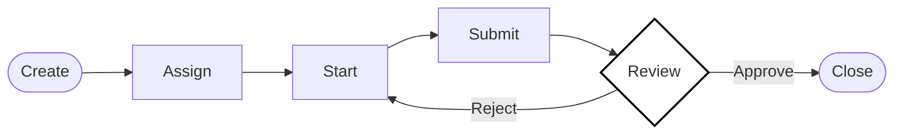

<div align="center">

# TaskFlow

**DDD-Compliant Go Workflow Backend with Hardened State Machine**

[](https://github.com/AsaqeLee/taskflow)
[](https://github.com/AsaqeLee/taskflow)
[](https://github.com/AsaqeLee/taskflow)

English | [简体中文](./README_ZH.md)

</div>

---

## Introduction

**TaskFlow** is a production-grade blueprint for task collaboration and lifecycle management. It prioritizes explicit state transitions, repository-based persistence abstractions, and low-friction developer recovery. By decoupling business logic from infrastructure, it scales from simple task tracking to complex, multi-actor workflows.

>[!IMPORTANT]
>This system treats task lifecycles as a formal state machine. Every action (assign, start, submit, approve) is validated against current state and actor permissions to ensure zero illegal transitions.

>[!NOTE]
>Current runtime baseline includes password-based registration, `POST /auth/login`, `POST /auth/refresh`, password reset, account disable and session revoke, JWT-only production auth, request/trace IDs, optional OTLP tracing, structured JSON logs, `/health` + `/livez` + `/readyz` + `/metrics`, versioned Mongo migrations, domain-driven soft delete with audit retention, assignee existence/active checks on assign, and Mongo-backed shared global/auth-scoped rate limiting plus idempotency when running with the Mongo driver. Task writes and identity-critical flows run inside Mongo transactions when the Mongo driver is enabled.

---

## Workflow Architecture

The core engine enforces a strict lifecycle: `create -> assign -> start -> submit -> approve/reject -> close`.



---

## Technical Specifications

<details>
<summary><b>Domain-Driven Design (DDD) Structure</b></summary>

```text
taskflow/
├── cmd/
│   ├── server/         # HTTP server entrypoint
│   └── migrate/        # Mongo migration CLI
├── internal/
│   ├── domain/         # Aggregates, entities, value objects, domain errors
│   │   ├── task/       # Task aggregate, state machine, domain events
│   │   ├── user/       # Account aggregate, Actor, Role
│   │   ├── identity/   # Refresh & password-reset token entities
│   │   ├── record/     # Collaboration record entity
│   │   ├── audit/      # Audit log entity & actions
│   │   ├── event/      # Domain event contract
│   │   └── ports/      # Repository interfaces (hexagonal boundaries)
│   ├── service/        # TaskService, IdentityService, event application
│   ├── repository/     # Mongo/Memory adapters (aliases to ports)
│   ├── model/          # HTTP DTOs & domain mappers
│   ├── handler/        # HTTP transport (depends on service, not repository)
│   ├── middleware/     # Auth, rate limit, idempotency, tracing
│   ├── router/         # Route wiring
│   ├── bootstrap/      # Dependency injection & app assembly
│   ├── config/
│   ├── database/       # Mongo client & transaction runner
│   ├── migrations/
│   └── observability/  # Logger, metrics, tracing
├── scripts/            # compose_smoke, security_audit, perf_smoke, rollback
├── deploy/             # OTLP collector example
└── reports/            # Security & performance baseline reports
```

**Layer rules**

| Layer | Responsibility | Depends on |
| --- | --- | --- |
| `domain/*` | Invariants, state transitions, aggregate behavior | domain packages only |
| `domain/ports` | Persistence contracts | domain types |
| `service` | Use-case orchestration, transactions, event persistence | `domain`, `ports`, `model` |
| `repository` | Mongo/Memory implementations | `domain`, `ports` |
| `handler` / `middleware` / `router` | HTTP transport & cross-cutting concerns | `service`, `ports` (auth lookup), `model` |

Key application services:

- `TaskService` — task lifecycle, audit/record side effects, assignee validation
- `IdentityService` — `Authenticate`, registration, refresh rotation, password reset, disable
</details>

<details>
<summary><b>HTTP API Surface</b></summary>

Public:

- `POST /users`, `POST /auth/login`, `POST /auth/refresh`
- `POST /auth/password-reset/request`, `POST /auth/password-reset/confirm`

Authenticated:

- `GET /me`, `POST /users/:id/disable`, `POST /users/:id/revoke-sessions`
- `POST /tasks`, `GET /tasks`, `GET /tasks/:id`, `PATCH /tasks/:id`, `DELETE /tasks/:id`
- `POST /tasks/:id/{assign,start,submit,reject,approve,close,cancel,reactivate}`
- `GET /tasks/:id/records`, `GET /tasks/:id/audit_logs`

System:

- `GET /health`, `GET /livez`, `GET /readyz`, `GET /metrics`
</details>

<details>
<summary><b>Dual-Persistence Driver Protocol</b></summary>

TaskFlow supports pluggable persistence through the Repository Pattern:
- **Memory Driver:** Optimized for lightning-fast local iteration and CI/CD testing.
- **Mongo Driver:** For production-grade persistence-path validation and horizontal scaling.
- **Switching:** Controlled via `TASK_REPOSITORY_DRIVER` environment variable without business logic changes.
</details>

<details>
<summary><b>Enterprise Installation & Usage</b></summary>

### Prerequisites
- Go 1.25.11 or higher
- MongoDB (optional, for production driver)

### Quick Start
```bash
# Clone the repository
git clone https://github.com/AsaqeLee/taskflow.git
cd taskflow

# Verify integrity
go test ./...

# Run local dev mode (enables seeded dev users and X-User-ID / legacy token fallback)
DEV_MODE=true TASK_REPOSITORY_DRIVER=memory JWT_SECRET=change-me go run ./cmd/server

# Register a password-based user
curl -X POST http://localhost:8080/users \
  -H 'Content-Type: application/json' \
  -d '{"id":"u_demo","name":"Demo User","role":"human","password":"strong-pass-123"}'

# Or login with an existing user
curl -X POST http://localhost:8080/auth/login \
  -H 'Content-Type: application/json' \
  -d '{"id":"u_demo","password":"strong-pass-123"}'

# Rotate a refresh token
curl -X POST http://localhost:8080/auth/refresh \
  -H 'Content-Type: application/json' \
  -d '{"refresh_token":"<refresh-token>"}'

# Boot the local Mongo + OTLP demo stack
docker compose up -d --build
bash scripts/compose_smoke.sh
```

For rollout discipline and migration expectations, see `DEPLOYMENT.md` and `MIGRATIONS.md`. For small-team intranet release gating, see [`INTRANET_RELEASE_CHECKLIST.md`](./INTRANET_RELEASE_CHECKLIST.md), [`INTRANET_RUNBOOK.md`](./INTRANET_RUNBOOK.md), and [`ACCEPTANCE_TESTING.md`](./ACCEPTANCE_TESTING.md).
</details>

---

## Strategic Boundaries

- **Audit Traceability:** Every state change triggers an `AuditLog` for professional accountability. Soft delete flows through the task aggregate (`MarkDeleted`) and still emits audit events; there is no repository-level hard-delete shortcut.
- **Built-In Account Baseline:** `IdentityService` owns authentication and account lifecycle. Password login, refresh-token rotation, password reset, disable, and session revoke are built in; SSO / OAuth remains an integration-layer concern.
- **Validated Persistence:** Task status values are validated on read (`ParseStatus`). Assign requires the target user to exist and remain active.
- **Clean Code:** Handler and router layers depend on `domain/ports`, not concrete repositories. Service layer re-exports repository errors for HTTP mapping.

---

<div align="center">

&copy; 2026 AsaqeLee. Built for deterministic workflow orchestration.

</div>
