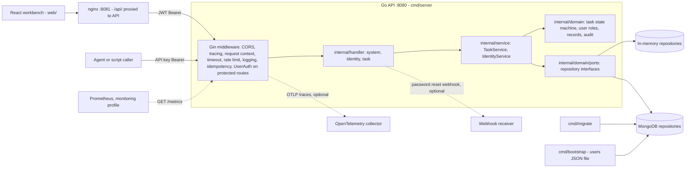
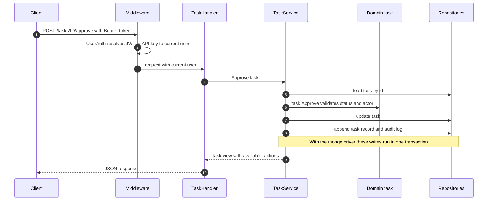
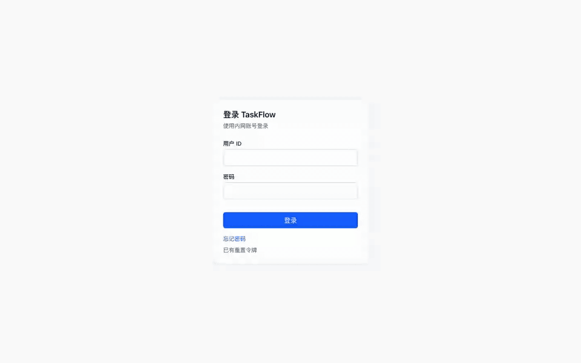
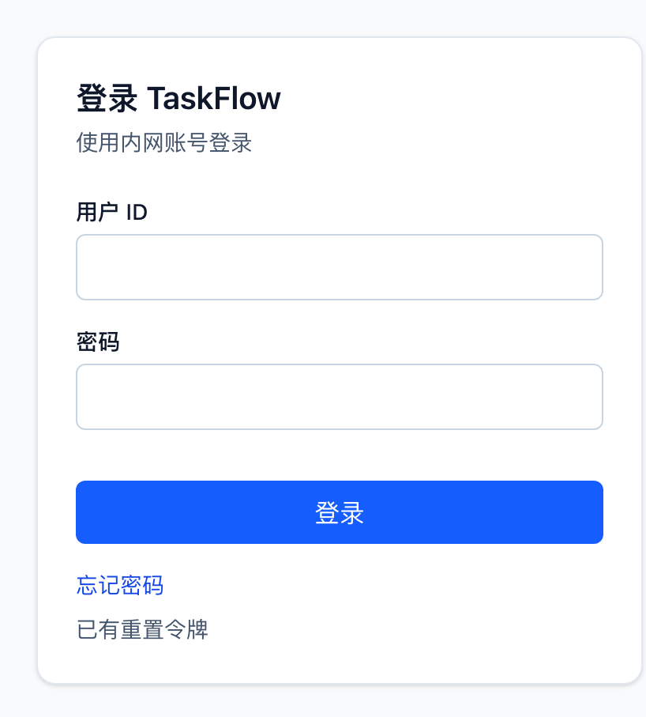
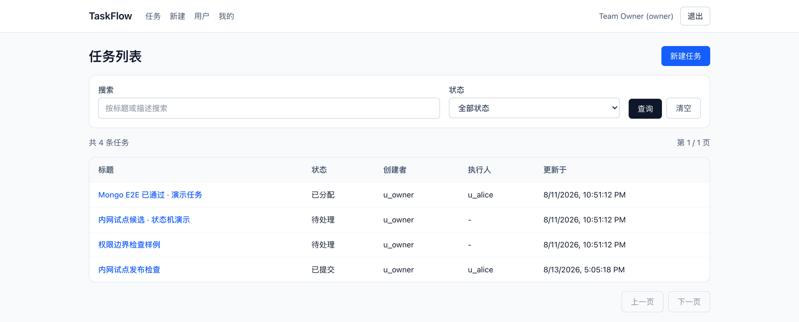
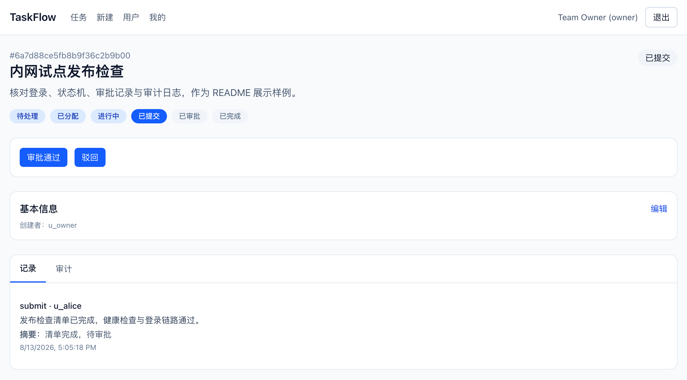
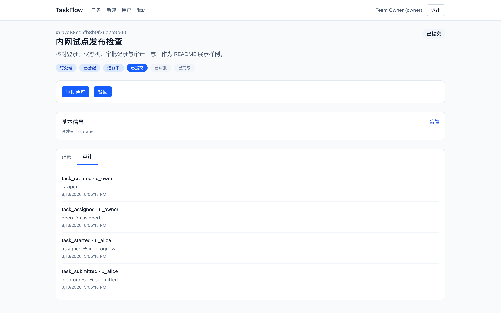
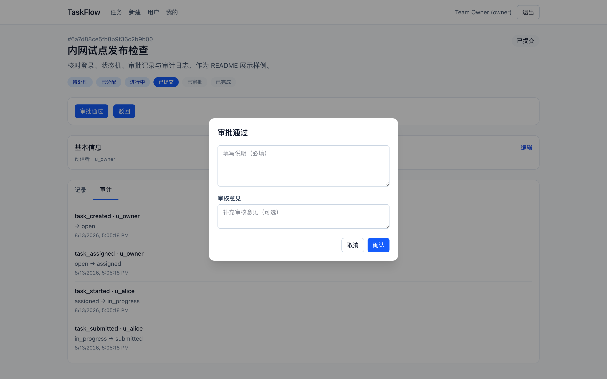
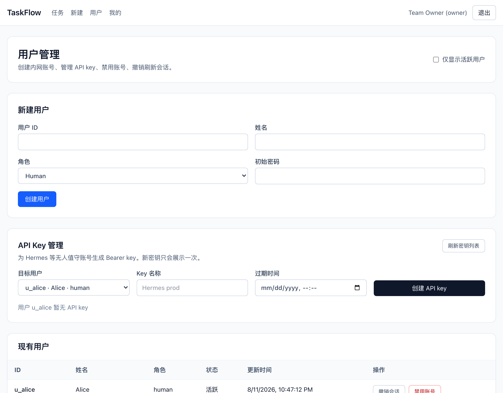

# TaskFlow

English | [简体中文](README.zh-CN.md)

[](https://github.com/AsaqeLee/taskflow/actions/workflows/ci.yml)
[](go.mod)
[](LICENSE)
[](https://github.com/AsaqeLee/taskflow/commits/main)

Internal task workflow system: **Go API** + **React** workbench + **MongoDB** (or in-memory) persistence.

```text
create → assign → start → submit → approve/reject → close
```

**Status:** intranet MVP / pilot candidate. **Maintenance mode** — not an enterprise production product.

## Table of contents

- [Architecture](#architecture)
- [Why this exists](#why-this-exists)
- [Features / scope](#features--scope)
- [Demo](#demo)
- [Requirements](#requirements)
- [Quick start](#quick-start)
- [Configuration](#configuration)
- [Project layout](#project-layout)
- [API surface (summary)](#api-surface-summary)
- [Tests](#tests)
- [Ops docs](#ops-docs)
- [Status / limitations](#status--limitations)
- [License](#license)

## Architecture

**Stack:** Go (Gin), MongoDB, React + Vite, JWT sessions, API keys for unattended callers.

Component view (derived from `cmd/`, `internal/bootstrap`, `internal/router`, `deploy/nginx.conf`, and `docker-compose.yml`):


```mermaid
flowchart LR
  WEB["React workbench - web/"] --> NGINX["nginx :8081 - /api/ proxied to API"]
  NGINX -->|"JWT Bearer"| MW
  AGENT["Agent or script caller"] -->|"API key Bearer"| MW

  subgraph API["Go API :8080 - cmd/server"]
    MW["Gin middleware: CORS, tracing, request context, timeout, rate limit, logging, idempotency, UserAuth on protected routes"]
    H["internal/handler: system, identity, task"]
    S["internal/service: TaskService, IdentityService"]
    D["internal/domain: task state machine, user roles, records, audit"]
    P["internal/domain/ports: repository interfaces"]
    MW --> H --> S
    S --> D
    S --> P
  end

  P --> MEM[("In-memory repositories")]
  P --> MONGO[("MongoDB repositories")]
  MIG["cmd/migrate"] --> MONGO
  BOOT["cmd/bootstrap - users JSON file"] --> MONGO
  H -.->|"password reset webhook, optional"| HOOK["Webhook receiver"]
  MW -.->|"OTLP traces, optional"| OTEL["OpenTelemetry collector"]
  PROM["Prometheus, monitoring profile"] -.->|"GET /metrics"| MW
```

Request flow for a lifecycle action (for example `approve`):


```mermaid
sequenceDiagram
  autonumber
  participant C as Client
  participant M as Middleware
  participant H as TaskHandler
  participant S as TaskService
  participant D as Domain task
  participant R as Repositories
  C->>M: POST /tasks/ID/approve with Bearer token
  M->>M: UserAuth resolves JWT or API key to current user
  M->>H: request with current user
  H->>S: ApproveTask
  S->>R: load task by id
  S->>D: task.Approve validates status and actor
  S->>R: update task
  S->>R: append task record and audit log
  Note over S,R: With the mongo driver these writes run in one transaction
  S-->>H: task view with available_actions
  H-->>C: JSON response
```

## Why this exists

- Explicit task state machine with role-constrained actions — not a generic CRUD list
- Dual persistence (`mongo` + `memory`) and a JWT-session vs API-key boundary for humans vs agents

## Features / scope

- Explicit state machine; backend returns `available_actions` (UI keeps a fallback matrix)
- JWT login, refresh rotation, password reset, account disable, session revoke
- API keys for unattended / agent callers
- Collaboration records and append-only audit log per task
- Health / ready / live / metrics, structured logs, optional OTLP
- Migrations, bootstrap, and backup scripts for Mongo deployments
- Same-origin nginx workbench: list, detail, create, users, profile

## Demo

Local compose walkthrough (login → task list → submitted task → audit → approve dialog).



[MP4](docs/demo/walkthrough.mp4)

| Login | Task list |
|---|---|
|  |  |

| Task detail | Audit |
|---|---|
|  |  |

| Approve | Users |
|---|---|
|  |  |

Media notes: [`docs/demo/README.md`](docs/demo/README.md). Screenshots are from a local stack, not a live intranet deployment.

## Requirements

- Go `1.25.13` (as used by this repository)
- Node `22` for the web workbench
- Docker / Compose for the full local stack (optional)
- MongoDB when `TASK_REPOSITORY_DRIVER=mongo`

## Quick start

### API only (fastest)

No database is needed: the `memory` driver keeps everything in process.

```bash
git clone https://github.com/AsaqeLee/taskflow.git
cd taskflow

go test ./...

DEV_MODE=true \
TASK_REPOSITORY_DRIVER=memory \
JWT_SECRET=change-me-change-me-change-me-123 \
go run ./cmd/server
```

The server listens on `:8080` (`PORT`). Dev-mode seed users (local only):

- `u_test_001` / `creator-pass-123` (role `owner`)
- `u_test_002` / `assignee-pass-123` (role `human`)
- `u_agent_001` / `agent-pass-123` (role `agent`)

### Try the API with curl

In a second terminal (uses `jq` to extract the token):

```bash
curl -s http://127.0.0.1:8080/health
# {"app_version":"dev","status":"ok"}

# Log in (the body field is `id`, not `username`)
TOKEN=$(curl -s -X POST http://127.0.0.1:8080/auth/login \
  -H 'Content-Type: application/json' \
  -d '{"id":"u_test_001","password":"creator-pass-123"}' | jq -r .access_token)
# full response: {"access_token":"...","refresh_token":"...","token_type":"Bearer",
#                 "expires_in_seconds":7200,"refresh_expires_in_seconds":604800,"user":{...}}

# Create a task
curl -s -X POST http://127.0.0.1:8080/tasks \
  -H "Authorization: Bearer $TOKEN" -H 'Content-Type: application/json' \
  -d '{"title":"Prepare weekly report","description":"Collect metrics"}'
# {"task":{"id":"task_001","title":"Prepare weekly report","description":"Collect metrics",
#          "status":"open","available_actions":["assign","cancel","delete"],
#          "creator_id":"u_test_001","assignee_id":"",...}}

# Assign it to the second seed user
curl -s -X POST http://127.0.0.1:8080/tasks/task_001/assign \
  -H "Authorization: Bearer $TOKEN" -H 'Content-Type: application/json' \
  -d '{"assignee_id":"u_test_002"}'
# {"task":{"id":"task_001",...,"status":"assigned","assignee_id":"u_test_002",...}}

# List tasks (paginated)
curl -s "http://127.0.0.1:8080/tasks?page=1&page_size=10" -H "Authorization: Bearer $TOKEN"
# {"page":1,"page_size":10,"tasks":[...],"total":1}
```

### Frontend preview

Start the API first, then:

```bash
cd web
npm ci
VITE_API_PROXY_TARGET=http://localhost:8080 npm run dev
```

Open `http://127.0.0.1:5173`. Vite proxies `/api` to the backend.

### Local Mongo + UI (demo stack)

```bash
docker compose --profile full up -d --build
bash scripts/compose_smoke.sh
bash scripts/nginx_smoke.sh
```

- API: `http://127.0.0.1:8080`
- Web: `http://127.0.0.1:8081`
- Mongo on the host: `127.0.0.1:27018`

Compose bootstrap users come from the mounted users file. Do not commit real passwords.

## Configuration

Configuration is read from environment variables in [`internal/config/config.go`](internal/config/config.go). [`.env.example`](.env.example) lists every variable; the most important ones are:

| Variable | Default | Meaning |
|----------|---------|---------|
| `PORT` | `8080` | HTTP listen port |
| `DEV_MODE` | `false` | Seeds the demo users and relaxes auth for local use |
| `TASK_REPOSITORY_DRIVER` | `memory` | `memory` or `mongo` |
| `MONGODB_URI` / `MONGODB_URI_FILE` | `mongodb://localhost:27017` | Mongo connection string (or a file containing it) |
| `MONGODB_DATABASE` | `taskflow` | Mongo database name |
| `JWT_SECRET` / `JWT_SECRET_FILE` | _(required)_ | Required unless `DEV_MODE=true`; at least 32 characters when `DEV_MODE=false` |
| `ALLOW_PUBLIC_REGISTER` | same as `DEV_MODE` | Exposes `POST /users` without authentication |
| `CORS_ALLOWED_ORIGINS` | _(empty)_ | Comma-separated allowed origins |
| `ACCESS_TOKEN_TTL` / `REFRESH_TOKEN_TTL` | `2h` / `168h` | Token lifetimes |
| `PASSWORD_RESET_WEBHOOK_URL` | _(empty)_ | Delivery endpoint for password-reset tokens |
| `STRICT_PRODUCTION_CONFIG` | `false` | Refuses to start with unsafe settings, e.g. dev mode, memory driver, placeholder secrets |
| `TRACING_ENABLED` / `TRACING_ENDPOINT` | `false` | Optional OTLP/HTTP trace export |
| `LOG_LEVEL` | `info` | `debug`, `info`, `warn`, or `error` |

## Project layout

```text
taskflow/
├── cmd/                 # server, migrate, bootstrap
├── internal/            # domain, handlers, services, repos
├── web/                 # React + Vite workbench
├── docs/demo/
├── scripts/
├── deploy/
└── reports/
```

Inside `internal/`: `router` (routes and middleware chain), `middleware`, `handler`, `service`, `domain` (task, user, identity, record, audit, ports), `repository` (memory and Mongo implementations), `database` and `migrations` (Mongo), `auth` (JWT and password hashing), `config`, `observability` (logs, metrics, tracing), and `bootstrap` (application wiring).

## API surface (summary)

Public: `POST /auth/login` (body field `id`), refresh, password-reset, optional public registration.

Authenticated: `/me`, `/users`, task CRUD and lifecycle actions (`assign`, `start`, `submit`, `reject`, `approve`, `close`, `cancel`, `reactivate`), records, audit logs.

System: `GET /health` · `GET /livez` · `GET /readyz` · `GET /metrics`

The full route table is in [`internal/router/router.go`](internal/router/router.go).

## Tests

```bash
go test ./...
go vet ./...
cd web && npm ci && npm run lint && npm run test && npm run build
```

Mongo integration tests are skipped unless `TASKFLOW_MONGO_TEST_URI` points to a replica-set member (CI starts one).

Helpers: `scripts/compose_smoke.sh`, `scripts/web_build_smoke.sh`, `scripts/web_acceptance_smoke.sh`, `scripts/nginx_smoke.sh`, `scripts/intranet_acceptance.sh`, `scripts/security_audit.sh`.

CI: [`.github/workflows/ci.yml`](./.github/workflows/ci.yml).

## Ops docs

- [`DEPLOYMENT.md`](./DEPLOYMENT.md)
- [`MIGRATIONS.md`](./MIGRATIONS.md)
- [`INTRANET_RELEASE_CHECKLIST.md`](./INTRANET_RELEASE_CHECKLIST.md)
- [`INTRANET_RUNBOOK.md`](./INTRANET_RUNBOOK.md)
- [`INTRANET_OPS.md`](./INTRANET_OPS.md)
- [`ACCEPTANCE_TESTING.md`](./ACCEPTANCE_TESTING.md)

For any hardened intranet deploy: `DEV_MODE=false`, `STRICT_PRODUCTION_CONFIG=true`, `TASK_REPOSITORY_DRIVER=mongo`, and a real `PASSWORD_RESET_WEBHOOK_URL`. Mongo write paths that use transactions need a replica set member or `mongos`.

## Status / limitations

Maintenance-mode intranet MVP. Scope is intentionally bounded; do not describe it as enterprise production software.

## License

MIT. See [LICENSE](LICENSE).
