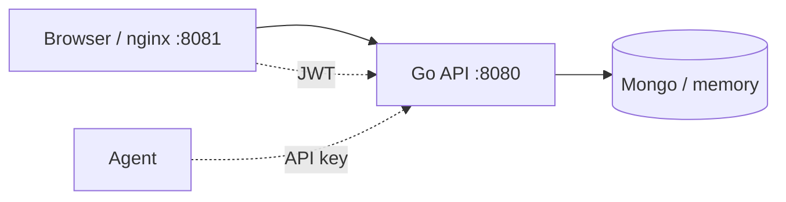

# TaskFlow

English | [简体中文](./README_ZH.md)

Internal task workflow system: **Go API** + **React** workbench + **MongoDB** (or in-memory) persistence.

```text
create → assign → start → submit → approve/reject → close
```

**Status:** intranet MVP / pilot candidate. **Maintenance mode** — not an enterprise production product.

[](https://github.com/AsaqeLee/taskflow/actions/workflows/ci.yml)

## Architecture


```mermaid
flowchart LR
  W[Browser / nginx :8081] --> API[Go API :8080]
  API --> S[(Mongo / memory)]
  W -.->|JWT| API
  K[Agent] -.->|API key| API
```

**Stack:** Go (Gin), MongoDB, React + Vite, JWT sessions, API keys for unattended callers.

## Why this exists

- Explicit task state machine with role-constrained actions — not a generic CRUD list
- Dual persistence (`mongo` + `memory`) and a JWT-session vs API-key boundary for humans vs agents

## Features / scope

- Explicit state machine; backend returns `available_actions` (UI keeps a fallback matrix)
- JWT login, refresh rotation, password reset, account disable, session revoke
- API keys for unattended / agent callers
- Collaboration records and append-only audit log per task
- Health / ready / live / metrics, structured logs, optional OTLP
- Migrations, bootstrap, and backup scripts for Mongo deployments
- Same-origin nginx workbench: list, detail, create, users, profile

## Demo

Local compose walkthrough (login → task list → submitted task → audit → approve dialog).


[MP4](docs/demo/walkthrough.mp4)

| Login | Task list |
|---|---|
|  |  |

| Task detail | Audit |
|---|---|
|  |  |

| Approve | Users |
|---|---|
|  |  |

Media notes: [`docs/demo/README.md`](docs/demo/README.md). Screenshots are from a local stack, not a live intranet deployment.

## Requirements

- Go `1.25.12` (as used by this repository)
- Node `22` for the web workbench
- Docker / Compose for the full local stack (optional)
- MongoDB when `TASK_REPOSITORY_DRIVER=mongo`

## Getting started

### API only (fastest)

```bash
go test ./...

DEV_MODE=true \
TASK_REPOSITORY_DRIVER=memory \
JWT_SECRET=change-me-change-me-change-me-123 \
go run ./cmd/server
```

Dev-mode seed users (local only):

- `u_test_001` / `creator-pass-123`
- `u_test_002` / `assignee-pass-123`
- `u_agent_001` / `agent-pass-123`

### Frontend preview

Start the API first, then:

```bash
cd web
npm ci
VITE_API_PROXY_TARGET=http://localhost:8080 npm run dev
```

Open `http://127.0.0.1:5173`. Vite proxies `/api` to the backend.

### Local Mongo + UI (demo stack)

```bash
docker compose --profile full up -d --build
bash scripts/compose_smoke.sh
bash scripts/nginx_smoke.sh
```

- API: `http://127.0.0.1:8080`
- Web: `http://127.0.0.1:8081`
- Mongo on the host: `127.0.0.1:27018`

Compose bootstrap users come from the mounted users file. Do not commit real passwords.

## Project layout

```text
taskflow/
├── cmd/                 # server, migrate, bootstrap
├── internal/            # domain, handlers, services, repos
├── web/                 # React + Vite workbench
├── docs/demo/
├── scripts/
├── deploy/
└── reports/
```

## API surface (summary)

Public: `POST /auth/login` (body field `id`), refresh, password-reset, optional public registration.

Authenticated: `/me`, `/users`, task CRUD and lifecycle actions (`assign`, `start`, `submit`, `reject`, `approve`, `close`, `cancel`, `reactivate`), records, audit logs.

System: `GET /health` · `GET /livez` · `GET /readyz` · `GET /metrics`

## Tests

```bash
go test ./...
go vet ./...
cd web && npm ci && npm run lint && npm run test && npm run build
```

Helpers: `scripts/compose_smoke.sh`, `scripts/web_build_smoke.sh`, `scripts/web_acceptance_smoke.sh`, `scripts/nginx_smoke.sh`, `scripts/intranet_acceptance.sh`, `scripts/security_audit.sh`.

CI: [`.github/workflows/ci.yml`](./.github/workflows/ci.yml).

## Ops docs

- [`DEPLOYMENT.md`](./DEPLOYMENT.md)
- [`MIGRATIONS.md`](./MIGRATIONS.md)
- [`INTRANET_RELEASE_CHECKLIST.md`](./INTRANET_RELEASE_CHECKLIST.md)
- [`INTRANET_RUNBOOK.md`](./INTRANET_RUNBOOK.md)
- [`INTRANET_OPS.md`](./INTRANET_OPS.md)
- [`ACCEPTANCE_TESTING.md`](./ACCEPTANCE_TESTING.md)

For any hardened intranet deploy: `DEV_MODE=false`, `STRICT_PRODUCTION_CONFIG=true`, `TASK_REPOSITORY_DRIVER=mongo`, and a real `PASSWORD_RESET_WEBHOOK_URL`. Mongo write paths that use transactions need a replica set member or `mongos`.

## Status / limitations

Maintenance-mode intranet MVP. Scope is intentionally bounded; do not describe it as enterprise production software.

## License

MIT. See [LICENSE](LICENSE).
