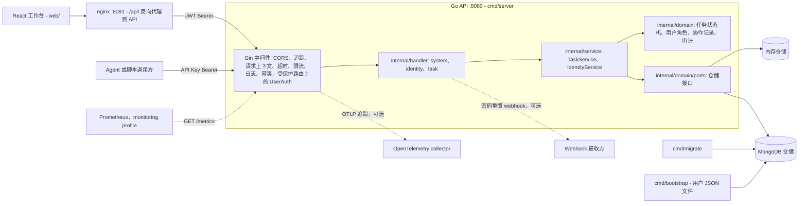
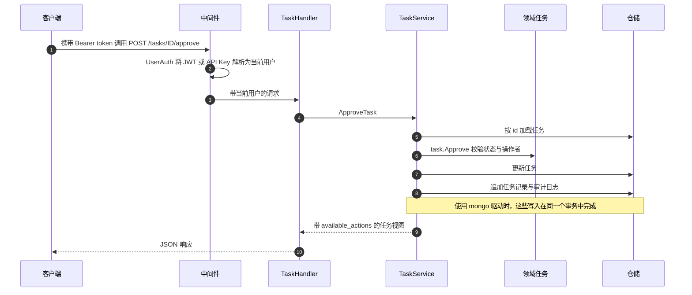

# TaskFlow

[English](README.md) | 简体中文

[](https://github.com/AsaqeLee/taskflow/actions/workflows/ci.yml)
[](go.mod)
[](LICENSE)
[](https://github.com/AsaqeLee/taskflow/commits/main)

内部任务工作流系统：**Go API** + **React** 工作台 + **MongoDB**（或内存）持久化。

```text
create → assign → start → submit → approve/reject → close
```

**状态：** 内网 MVP / 试点候选。**维护模式**——不是企业级生产产品。

## 目录

- [架构](#架构)
- [为什么做这个](#为什么做这个)
- [功能 / 范围](#功能--范围)
- [演示](#演示)
- [环境要求](#环境要求)
- [快速开始](#快速开始)
- [配置](#配置)
- [项目结构](#项目结构)
- [API 概览](#api-概览)
- [测试](#测试)
- [运维文档](#运维文档)
- [状态 / 局限](#状态--局限)
- [许可证](#许可证)

## 架构

**技术栈：** Go（Gin）、MongoDB、React + Vite、JWT 会话、面向无人值守调用方的 API Key。

组件视图（依据 `cmd/`、`internal/bootstrap`、`internal/router`、`deploy/nginx.conf` 和 `docker-compose.yml` 整理）：



一次生命周期动作（例如 `approve`）的请求流程：



## 为什么做这个

- 明确的任务状态机 + 受角色约束的动作——不是通用的 CRUD 列表
- 双持久化（`mongo` + `memory`），并区分人使用的 JWT 会话与 Agent 使用的 API Key

## 功能 / 范围

- 明确的状态机；后端返回 `available_actions`（UI 保留一份兜底矩阵）
- JWT 登录、刷新令牌轮换、密码重置、禁用账号、吊销会话
- 面向无人值守 / Agent 调用方的 API Key
- 每个任务的协作记录与只追加的审计日志
- health / ready / live / metrics、结构化日志、可选 OTLP
- 面向 Mongo 部署的迁移、初始化（bootstrap）与备份脚本
- 同源 nginx 工作台：列表、详情、创建、用户、个人资料

## 演示

本地 compose 演示流程（登录 → 任务列表 → 已提交任务 → 审计 → 审批对话框）。


[MP4](docs/demo/walkthrough.mp4)

| 登录 | 任务列表 |
|---|---|
|  |  |

| 任务详情 | 审计 |
|---|---|
|  |  |

| 审批 | 用户 |
|---|---|
|  |  |

媒体说明：[`docs/demo/README.md`](docs/demo/README.md)。截图来自本地环境，并非线上内网部署。

## 环境要求

- Go `1.25.12`（本仓库所用版本）
- Node `22`（用于 Web 工作台）
- Docker / Compose（可选，用于完整本地环境）
- 当 `TASK_REPOSITORY_DRIVER=mongo` 时需要 MongoDB

## 快速开始

### 仅启动 API（最快）

无需数据库：`memory` 驱动把所有数据保存在进程内。

```bash
git clone https://github.com/AsaqeLee/taskflow.git
cd taskflow

go test ./...

DEV_MODE=true \
TASK_REPOSITORY_DRIVER=memory \
JWT_SECRET=change-me-change-me-change-me-123 \
go run ./cmd/server
```

服务监听 `:8080`（`PORT`）。开发模式种子用户（仅限本地）：

- `u_test_001` / `creator-pass-123`（角色 `owner`）
- `u_test_002` / `assignee-pass-123`（角色 `human`）
- `u_agent_001` / `agent-pass-123`（角色 `agent`）

### 用 curl 试用 API

在第二个终端中执行（使用 `jq` 提取 token）：

```bash
curl -s http://127.0.0.1:8080/health
# {"app_version":"dev","status":"ok"}

# 登录（请求体字段是 `id`，不是 `username`）
TOKEN=$(curl -s -X POST http://127.0.0.1:8080/auth/login \
  -H 'Content-Type: application/json' \
  -d '{"id":"u_test_001","password":"creator-pass-123"}' | jq -r .access_token)
# 完整响应: {"access_token":"...","refresh_token":"...","token_type":"Bearer",
#           "expires_in_seconds":7200,"refresh_expires_in_seconds":604800,"user":{...}}

# 创建任务
curl -s -X POST http://127.0.0.1:8080/tasks \
  -H "Authorization: Bearer $TOKEN" -H 'Content-Type: application/json' \
  -d '{"title":"Prepare weekly report","description":"Collect metrics"}'
# {"task":{"id":"task_001","title":"Prepare weekly report","description":"Collect metrics",
#          "status":"open","available_actions":["assign","cancel","delete"],
#          "creator_id":"u_test_001","assignee_id":"",...}}

# 指派给第二个种子用户
curl -s -X POST http://127.0.0.1:8080/tasks/task_001/assign \
  -H "Authorization: Bearer $TOKEN" -H 'Content-Type: application/json' \
  -d '{"assignee_id":"u_test_002"}'
# {"task":{"id":"task_001",...,"status":"assigned","assignee_id":"u_test_002",...}}

# 分页列出任务
curl -s "http://127.0.0.1:8080/tasks?page=1&page_size=10" -H "Authorization: Bearer $TOKEN"
# {"page":1,"page_size":10,"tasks":[...],"total":1}
```

### 前端预览

先启动 API，然后：

```bash
cd web
npm ci
VITE_API_PROXY_TARGET=http://localhost:8080 npm run dev
```

打开 `http://127.0.0.1:5173`。Vite 会把 `/api` 代理到后端。

### 本地 Mongo + UI（演示环境）

```bash
docker compose --profile full up -d --build
bash scripts/compose_smoke.sh
bash scripts/nginx_smoke.sh
```

- API：`http://127.0.0.1:8080`
- Web：`http://127.0.0.1:8081`
- 宿主机上的 Mongo：`127.0.0.1:27018`

Compose 初始化用户来自挂载的用户文件。不要提交真实密码。

## 配置

配置通过环境变量读取，见 [`internal/config/config.go`](internal/config/config.go)。[`.env.example`](.env.example) 列出了全部变量；最重要的如下：

| 变量 | 默认值 | 含义 |
|------|--------|------|
| `PORT` | `8080` | HTTP 监听端口 |
| `DEV_MODE` | `false` | 写入演示种子用户，并为本地使用放宽认证 |
| `TASK_REPOSITORY_DRIVER` | `memory` | `memory` 或 `mongo` |
| `MONGODB_URI` / `MONGODB_URI_FILE` | `mongodb://localhost:27017` | Mongo 连接串（或包含连接串的文件） |
| `MONGODB_DATABASE` | `taskflow` | Mongo 数据库名 |
| `JWT_SECRET` / `JWT_SECRET_FILE` | _(必填)_ | 除非 `DEV_MODE=true`，否则必填；`DEV_MODE=false` 时至少 32 个字符 |
| `ALLOW_PUBLIC_REGISTER` | 与 `DEV_MODE` 相同 | 无需认证即可调用 `POST /users` |
| `CORS_ALLOWED_ORIGINS` | _(空)_ | 逗号分隔的允许来源 |
| `ACCESS_TOKEN_TTL` / `REFRESH_TOKEN_TTL` | `2h` / `168h` | 令牌有效期 |
| `PASSWORD_RESET_WEBHOOK_URL` | _(空)_ | 密码重置令牌的投递地址 |
| `STRICT_PRODUCTION_CONFIG` | `false` | 遇到不安全配置时拒绝启动，例如开发模式、memory 驱动、占位密钥 |
| `TRACING_ENABLED` / `TRACING_ENDPOINT` | `false` | 可选的 OTLP/HTTP 追踪导出 |
| `LOG_LEVEL` | `info` | `debug`、`info`、`warn` 或 `error` |

## 项目结构

```text
taskflow/
├── cmd/                 # server、migrate、bootstrap
├── internal/            # 领域、handler、service、仓储
├── web/                 # React + Vite 工作台
├── docs/demo/
├── scripts/
├── deploy/
└── reports/
```

`internal/` 内部：`router`（路由与中间件链）、`middleware`、`handler`、`service`、`domain`（task、user、identity、record、audit、ports）、`repository`（内存与 Mongo 实现）、`database` 与 `migrations`（Mongo）、`auth`（JWT 与密码哈希）、`config`、`observability`（日志、指标、追踪）以及 `bootstrap`（应用装配）。

## API 概览

公开接口：`POST /auth/login`（请求体字段 `id`）、刷新令牌、密码重置、可选的公开注册。

需认证接口：`/me`、`/users`、任务 CRUD 与生命周期动作（`assign`、`start`、`submit`、`reject`、`approve`、`close`、`cancel`、`reactivate`）、协作记录、审计日志。

系统接口：`GET /health` · `GET /livez` · `GET /readyz` · `GET /metrics`

完整路由表见 [`internal/router/router.go`](internal/router/router.go)。

## 测试

```bash
go test ./...
go vet ./...
cd web && npm ci && npm run lint && npm run test && npm run build
```

除非 `TASKFLOW_MONGO_TEST_URI` 指向一个副本集成员（CI 会启动一个），否则会跳过 Mongo 集成测试。

辅助脚本：`scripts/compose_smoke.sh`、`scripts/web_build_smoke.sh`、`scripts/web_acceptance_smoke.sh`、`scripts/nginx_smoke.sh`、`scripts/intranet_acceptance.sh`、`scripts/security_audit.sh`。

CI：[`.github/workflows/ci.yml`](./.github/workflows/ci.yml)。

## 运维文档

- [`DEPLOYMENT.md`](./DEPLOYMENT.md)
- [`MIGRATIONS.md`](./MIGRATIONS.md)
- [`INTRANET_RELEASE_CHECKLIST.md`](./INTRANET_RELEASE_CHECKLIST.md)
- [`INTRANET_RUNBOOK.md`](./INTRANET_RUNBOOK.md)
- [`INTRANET_OPS.md`](./INTRANET_OPS.md)
- [`ACCEPTANCE_TESTING.md`](./ACCEPTANCE_TESTING.md)

任何加固的内网部署都应设置：`DEV_MODE=false`、`STRICT_PRODUCTION_CONFIG=true`、`TASK_REPOSITORY_DRIVER=mongo`，以及真实的 `PASSWORD_RESET_WEBHOOK_URL`。使用事务的 Mongo 写路径需要副本集成员或 `mongos`。

## 状态 / 局限

处于维护模式的内网 MVP。范围有意受限；请勿将其描述为企业级生产软件。

## 许可证

MIT。见 [LICENSE](LICENSE)。
