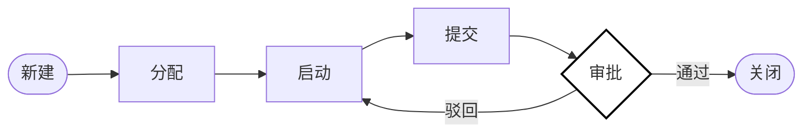

<div align="center">

# TaskFlow

**遵循领域驱动设计 (DDD) 的 Go 语言工作流后端**

[](https://github.com/AsaqeLee/taskflow)
[](https://github.com/AsaqeLee/taskflow)
[](https://github.com/AsaqeLee/taskflow)

[English](./README.md) | 简体中文

</div>

---

## 项目简介

**TaskFlow** 是一个用于任务协作和生命周期管理的生产级蓝图。它优先考虑显式的状态转移、基于仓库模式 (Repository Pattern) 的持久化抽象以及低摩擦的开发恢复流程。通过将业务逻辑与基础设施解耦，它可以从简单的任务跟踪扩展到复杂的多角色协作工作流。

>[!IMPORTANT]
>本系统将任务生命周期视为形式化的状态机。每一个动作（分配、启动、提交、审批）都会根据当前状态和操作者权限进行验证，以确保零非法状态转移。

>[!NOTE]
>当前运行时基线已包含：基于密码的注册、`POST /auth/login`、`POST /auth/refresh`、密码重置、账号禁用与会话吊销、生产环境 JWT 鉴权、请求/链路 ID、可选 OTLP tracing、结构化 JSON 日志、`/health` + `/livez` + `/readyz` + `/metrics`、Mongo 版本化迁移、领域驱动的软删除与审计保留、分配任务时的被指派者存在/活跃校验，以及在 Mongo 驱动下可跨实例共享的全局/认证分层限流与幂等键存储。启用 Mongo 驱动时，任务写入与身份关键流程会在事务中执行。

---

## 核心架构

核心引擎强制执行严格的生命周期：`新建 -> 分配 -> 启动 -> 提交 -> 审批/驳回 -> 关闭`。



---

## 技术规格

<details>
<summary><b>领域驱动设计 (DDD) 目录结构</b></summary>

```text
taskflow/
├── cmd/
│   ├── server/         # HTTP 服务入口
│   └── migrate/        # Mongo migration CLI
├── internal/
│   ├── domain/         # 聚合根、实体、值对象、领域错误
│   │   ├── task/       # 任务聚合、状态机、领域事件
│   │   ├── user/       # 账户聚合、Actor、Role
│   │   ├── identity/   # Refresh / 密码重置 token 实体
│   │   ├── record/     # 协作记录实体
│   │   ├── audit/      # 审计日志实体与动作
│   │   ├── event/      # 领域事件契约
│   │   └── ports/      # 仓储接口（六边形边界）
│   ├── service/        # TaskService、IdentityService、事件落库
│   ├── repository/     # Mongo/内存适配器（ports 类型别名）
│   ├── model/          # HTTP DTO 与领域映射
│   ├── handler/        # HTTP 传输层（依赖 service，不依赖 repository）
│   ├── middleware/     # 鉴权、限流、幂等、tracing
│   ├── router/         # 路由装配
│   ├── bootstrap/      # 依赖注入与应用组装
│   ├── config/
│   ├── database/       # Mongo 客户端与事务执行
│   ├── migrations/
│   └── observability/  # 日志、指标、tracing
├── scripts/            # compose_smoke、security_audit、perf_smoke、rollback
├── deploy/             # OTLP collector 示例
└── reports/            # 安全与性能基线报告
```

**分层规则**

| 层级 | 职责 | 依赖 |
| --- | --- | --- |
| `domain/*` | 不变量、状态转移、聚合行为 | 仅 domain 包 |
| `domain/ports` | 持久化契约 | domain 类型 |
| `service` | 用例编排、事务、事件持久化 | `domain`、`ports`、`model` |
| `repository` | Mongo/内存实现 | `domain`、`ports` |
| `handler` / `middleware` / `router` | HTTP 传输与横切能力 | `service`、`ports`（鉴权查询）、`model` |

核心应用服务：

- `TaskService` — 任务生命周期、审计/记录副作用、被指派者校验
- `IdentityService` — `Authenticate`、注册、refresh 轮转、密码重置、禁用账户
</details>

<details>
<summary><b>HTTP API 一览</b></summary>

公开接口：

- `POST /users`、`POST /auth/login`、`POST /auth/refresh`
- `POST /auth/password-reset/request`、`POST /auth/password-reset/confirm`

鉴权后接口：

- `GET /me`、`POST /users/:id/disable`、`POST /users/:id/revoke-sessions`
- `POST /tasks`、`GET /tasks`、`GET /tasks/:id`、`PATCH /tasks/:id`、`DELETE /tasks/:id`
- `POST /tasks/:id/{assign,start,submit,reject,approve,close,cancel,reactivate}`
- `GET /tasks/:id/records`、`GET /tasks/:id/audit_logs`

系统接口：

- `GET /health`、`GET /livez`、`GET /readyz`、`GET /metrics`
</details>

<details>
<summary><b>双持久化驱动协议 (Repository Pattern)</b></summary>

TaskFlow 通过仓库模式支持可插拔的持久化层：
- **内存驱动 (Memory Driver):** 针对极速本地迭代和 CI/CD 测试进行了优化。
- **Mongo 驱动 (Mongo Driver):** 用于生产级的持久化路径验证和水平扩展。
- **切换机制:** 通过 `TASK_REPOSITORY_DRIVER` 环境变量控制，无需修改业务逻辑。
</details>

<details>
<summary><b>企业级安装与使用</b></summary>

### 前置要求
- Go 1.25.11 或更高版本
- MongoDB (可选，用于生产驱动)

### 快速开始
```bash
# 克隆仓库
git clone https://github.com/AsaqeLee/taskflow.git
cd taskflow

# 完整性验证
go test ./...

# 本地开发模式启动（启用 seeded 测试用户与 X-User-ID / 旧 token fallback）
DEV_MODE=true TASK_REPOSITORY_DRIVER=memory JWT_SECRET=change-me go run ./cmd/server

# 注册带密码的新用户
curl -X POST http://localhost:8080/users \
  -H 'Content-Type: application/json' \
  -d '{"id":"u_demo","name":"Demo User","role":"human","password":"strong-pass-123"}'

# 或登录已有用户
curl -X POST http://localhost:8080/auth/login \
  -H 'Content-Type: application/json' \
  -d '{"id":"u_demo","password":"strong-pass-123"}'

# 轮转 refresh token
curl -X POST http://localhost:8080/auth/refresh \
  -H 'Content-Type: application/json' \
  -d '{"refresh_token":"<refresh-token>"}'

# 启动本地 Mongo + OTLP 演示栈
docker compose up -d --build
bash scripts/compose_smoke.sh
```

部署顺序与 migration 纪律请参考 `DEPLOYMENT.md` 和 `MIGRATIONS.md`。小团队内网 MVP 实施清单见 [`INTRANET_MVP.md`](./INTRANET_MVP.md)。
</details>

---

## 战略边界

- **审计追踪:** 每一个状态变更都会触发 `AuditLog`。软删除通过任务聚合的 `MarkDeleted` 完成并保留审计，不存在仓储层硬删除捷径。
- **内建账户基线:** `IdentityService` 统一承载认证与账户生命周期。密码登录、refresh 轮转、密码重置、禁用与会话吊销已内置；SSO / OAuth 仍属于后续集成层能力。
- **持久化校验:** 任务状态读取时经 `ParseStatus` 校验；分配任务要求被指派者存在且处于活跃状态。
- **分层清晰:** Handler 与 Router 依赖 `domain/ports`，不直接依赖具体仓储实现；Service 层向 HTTP 层导出可映射的错误类型。

---

<div align="center">

&copy; 2026 AsaqeLee. 为确定性工作流编排而生。

</div>
