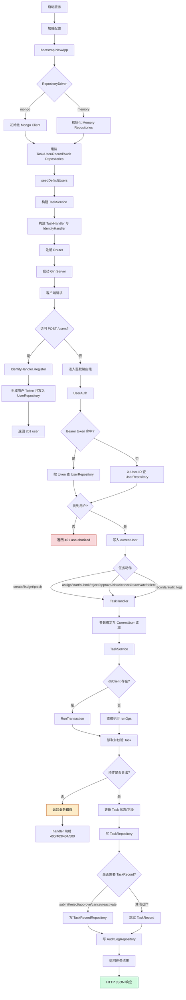
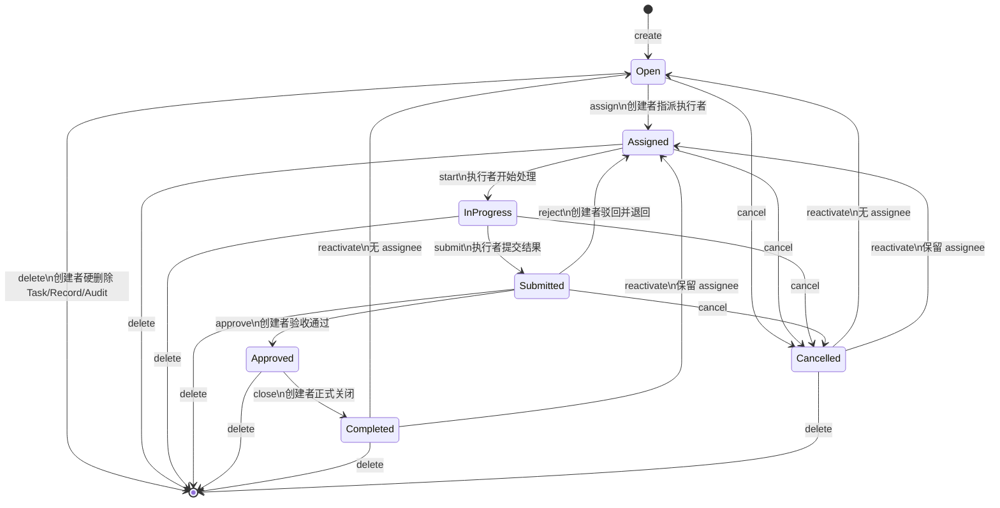

# TaskFlow 流程流转图

本文基于当前仓库实现整理，目标是把 TaskFlow 从应用启动、用户进入、任务动作、状态流转，到 `TaskRecord` / `AuditLog` 留痕与删除清理的完整过程画成可维护的 Mermaid 图。事实来源以代码和测试为准，见文末引用。

## 1. 系统处理流

## 2. 任务状态流转图

## 3. 读图说明

- `POST /users` 是唯一公开写入口；其余任务接口都先走 `UserAuth`。
- `create / assign / start / close` 只写 `Task + AuditLog`；`submit / reject / approve / cancel / reactivate` 会同时写 `TaskRecord + AuditLog`。
- `reject` 会把任务从 `submitted` 退回到 `assigned`，而不是直接回到 `in_progress`，这样可以保留再次 `start` 的显式语义。
- `reactivate` 会根据 `assignee_id` 是否为空，恢复到 `open` 或 `assigned`。
- `delete` 是硬删除：`Task`、`TaskRecord`、`AuditLog` 都会级联清理。

## 4. 主要依据

- 主链与接口范围：`README.md:12`、`README.md:44`、`README.md:129`
- 应用装配与双驱动分支：`internal/bootstrap/app.go:25`
- 路由入口与公开/鉴权分组：`internal/router/router.go:10`
- 鉴权优先级与 401 分支：`internal/middleware/current_user.go:25`
- Handler 的请求解析与错误映射：`internal/handler/task.go:39`、`internal/handler/task.go:297`
- 状态机与留痕规则：`internal/service/task_service.go:70`、`internal/service/task_service.go:188`、`internal/service/task_service.go:246`、`internal/service/task_service.go:298`、`internal/service/task_service.go:367`、`internal/service/task_service.go:436`、`internal/service/task_service.go:505`、`internal/service/task_service.go:557`
- 全链路验证顺序：`internal/handler/task_mongo_e2e_test.go:26`
